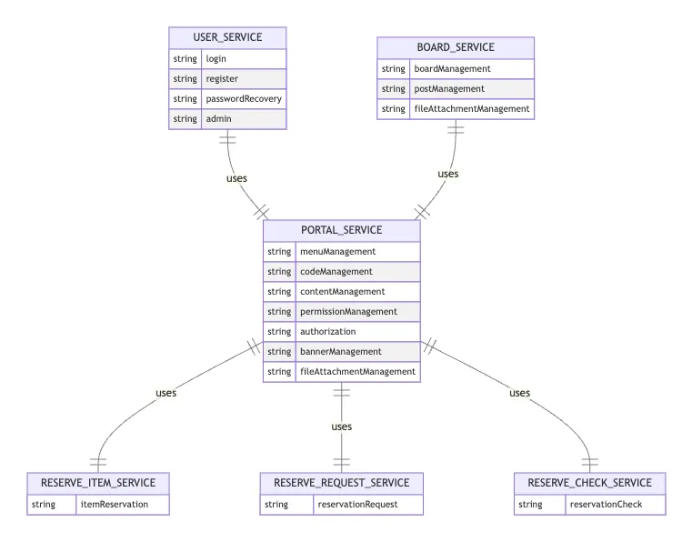
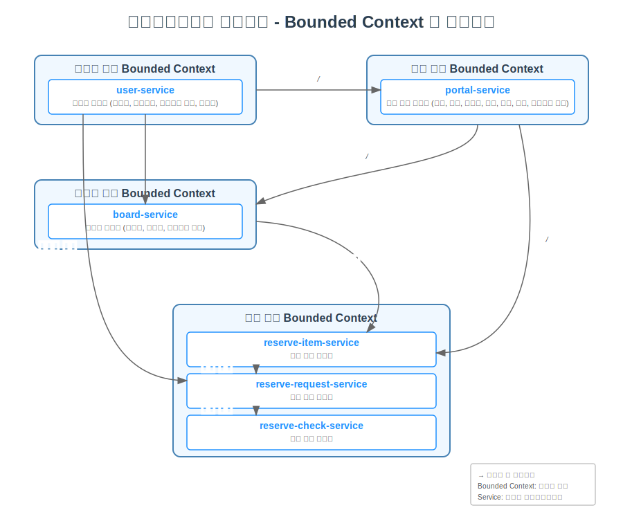

# Bounded Context

## Bounded Context의 정의

Bounded Context는 마이크로서비스 아키텍처에서 서비스 간 경계를 명확히 하여 서비스가 독립적으로 운영되도록 돕는 개념

## Bounded Context의 특징

1. 독립적인 데이터베이스
2. 독립적인 배포
3. 독립적인 테스트
4. 독립적인 인프라

## Bounded Context의 장단점

| 장점 | 단점 |
|------|------|
| 서비스 간 독립성 보장 | 서비스 간 통합 복잡성 증가 |
| 기술 스택 자유롭게 선택 가능 | 분산 트랜잭션 처리 어려움 |
| 확장성 및 유연성 향상 | 초기 설계 및 구현 비용 증가 |
| 장애 격리 용이 | 운영 및 모니터링 복잡성 |
| 팀 간 독립적 개발 가능 | 데이터 중복 및 일관성 관리 필요 |
| 빠른 배포 및 릴리스 주기 | 네트워크 지연 및 오버헤드 발생 |

## Bounded Context의 예시

- 마이크로서비스 아키텍처(MSA)에서 Bounded Context는 특정 도메인 모델이 적용되는 경계를 정의하는 중요한 개념

- 이 프로젝트에서 Bounded Context는 다음과 같이 마이크로서비스 단위로 구현되어 있음:

- 사용자 관련 Bounded Context
  - **user-service**: 사용자 서비스 (로그인, 회원가입, 비밀번호 찾기, 관리자)
- 포털 공통 Bounded Context
  - **portal-service**: 포털 공통 서비스 (메뉴, 코드, 컨텐츠, 권한, 인가, 배너, 첨부파일 관리)
- 게시판 관련 Bounded Context
  - **board-service**: 게시판 서비스 (게시판, 게시물, 첨부파일 관리)
- 예약 관련 Bounded Context (3개의 서비스로 분리됨)
  - **reserve-item-service**: 예약 물품 서비스
  - **reserve-request-service**: 예약 신청 서비스
  - **reserve-check-service**: 예약 확인 서비스

- 
- 
- 각 서비스는 자체 데이터베이스 스키마와 API를 가지고 있으며, 독립적으로 개발, 배포, 확장이 가능한 형태로 구성되어 있음. 이는 DDD(Domain-Driven Design)의 Bounded Context 원칙을 마이크로서비스 아키텍처로 구현한 좋은 예시

- 또한 이 프로젝트에서는 다음과 같은 인프라 서비스들이 이러한 Bounded Context들을 지원함:
  - **apigateway**: API 관리 및 모니터링
  - **config**: 중앙화된 설정 관리
  - **discovery**: 서비스 디스커버리 (서비스 등록 및 검색)
- 각 Bounded Context는 자체 도메인 로직과 데이터 모델을 가지고 있으며, 필요에 따라 다른 Bounded Context와 통신하여 전체 시스템을 구성