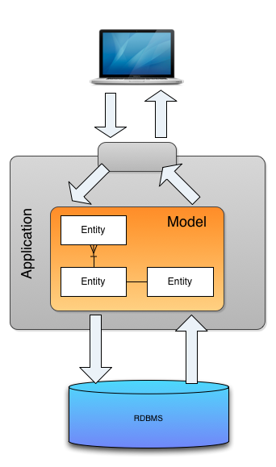
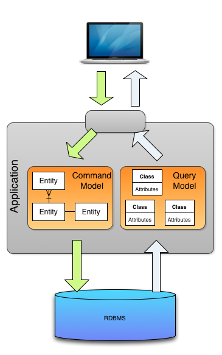
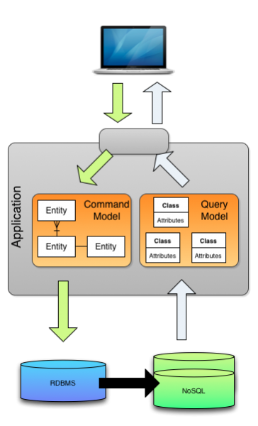

# CQRS(Command Query Responsibility Segregation)

## CQRS란?

CQRS는 "Command Query Responsibility Segregation"의 약자로, **명령(Command)** 모듈과 **조회(Query)** 모듈의 책임을 분리하는 아키텍처 패턴. 전통적인 CRUD 모델에서는 데이터에 대한 읽기와 쓰기 작업이 동일한 모델과 데이터 저장소를 사용하지만, CQRS는 이 두 가지를 명확히 분리함
- **Command(명령):**  시스템의 상태를 변경하는 작업(Create, Update, Delete)을 의미
- **Query(조회):**  시스템의 상태를 조회하는 작업(Read)을 의미
- **책임 분리:**  명령과 조회를 각각 별도의 모델, 서비스, 데이터 저장소로 분리하여 설계

## CQRS의 장점

1. **확장성(Scalability):**  읽기/쓰기 작업을 독립적으로 확장할 수 있음
2. **성능 최적화:**  조회 모델을 읽기 전용으로 최적화할 수 있음
3. **복잡성 관리:**  도메인 복잡도가 높은 시스템에서 명령과 조회의 로직을 분리하여 관리가 용이
4. **보안 및 권한 관리:**  쓰기와 읽기에 대해 별도의 보안 정책을 적용할 수 있음

## CQRS의 단점

1. **구현 복잡성 증가:**  시스템 구조가 복잡해지고, 데이터 동기화 이슈가 발생할 수 있음
2. **데이터 일관성 문제:**  쓰기와 읽기 저장소가 분리된 경우, 최종 일관성(Eventual Consistency) 모델을 적용해야 함
3. **적용이 불필요한 경우:**  단순한 CRUD 애플리케이션에는 오히려 과도한 설계가 될 수 있음

## CQRS의 구조

### 전통적인 CRUD 모델

### 데이터베이스는 하나를 사용하고 모델 레이어만 분리한 CQRS 구조
- Command 모델과 Query 모델을 분리함으로써, 각 모델의 역할에 집중할 수 있기 때문에 코드의 명확성과 유지보수성이 향상되지만 데이터베이스를 하나만 사용하기 때문에 성능 문제는 개선하지 못함
 

### 데이터베이스와 모델 레이어를 분리한 CQRS 구조
- 각 모델에 적합한 데이터베이스를 사용하여 성능을 향상시킬 수 있음
- Broker를 통해서 Command 데이터베이스와 Query 데이터베이스를 동기화해줘야 함
 

## 언제 CQRS를 도입하는게 좋을까?

- **시스템 규모가 커지고 복잡해지는 경우**: 복잡한 시스템에서 Command와 Query 작업을 분리함으로써 시스템의 구조를 단순화하고, 각 역할의 독립성을 높임
- **확장성과 성능이 중요한 경우**: Command와 Query 작업을 분리하여 각가의 작업에 최적화된 데이터베이스 또는 모델을 사용할 수 있음. 예를 들어 Command 작업에서는 트랜잭션이 중요하기 때문에 RDB를 사용하고, Query 작업에서는 조회 성능이 좋은 NoSQL을 사용할 수 있음

#### CQRS 도입을 피해야 하는 경우
- **도메인이나 비즈니스 로직이 단순한 시스템**: 비즈니스 로직이 단순한 시스템에서는 CQRS를 도입하게 되면 불필요한 오버헤드를 발생시킬 수 있음
- **개발팀의 경험과 역량이 부족할 경우**: CQRS를 도입하게 되면 시스템 설계 방식이 복잡해지기 때문에, 개발자의 충분한 경험과 역량이 필요함

## CQRS 사용 사례
- **배달의민족(B마트):**  
  전시 도메인(카탈로그, 상품 등)에 CQRS를 적용해 명령/조회 모델을 분리, 이벤트 기반 동기화로 성능과 유지보수성 개선([참고 링크](https://www.youtube.com/watch?v=fg5xbs59Lro&t=6s))
- **강남언니:**  
  의료 SaaS, 병원 운영 등 다양한 도메인에서 CQRS와 이벤트 소싱을 결합해 명령/조회 분리, 이벤트 기반 데이터 동기화, 시스템 확장성과 복잡한 비즈니스 요구 대응력을 확보([참고 링크](https://blog.gangnamunni.com/post/saas-event-sourcing/))
  

## 결론

CQRS는 MSA에서 확장성, 성능, 유지보수성을 강화하는 데 매우 유용한 패턴. 특히 복잡한 비즈니스 로직, 읽기/쓰기 트래픽 불균형, 다양한 조회 요구사항이 있는 대규모 시스템에서 두 패턴을 함께 적용하면 큰 시너지를 얻을 수 있음. 하지만, 모든 시스템에 적합한 것은 아니므로, 도입 전에 시스템의 요구사항과 복잡성을 충분히 고려해야 함

## 참고
- CQRS by Martin Fowler
  - https://martinfowler.com/bliki/CQRS.html
- Microsoft CQRS 패턴
  - https://learn.microsoft.com/ko-kr/azure/architecture/patterns/cqrs
- CQRS - Command Query Responsibility Segregation
  - http://auconsil.blogspot.com/2013/08/cqrs-command-query-responsibility.html