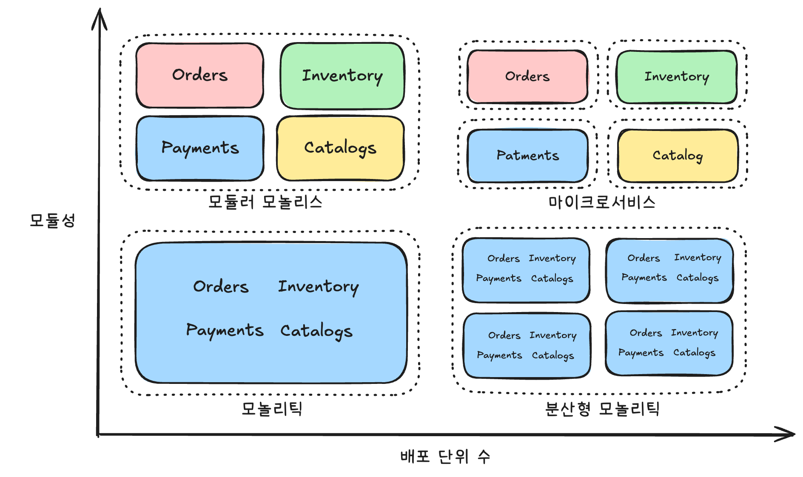

# Modular Monolith
- [전통적 모놀리스](./monolith.md)
- [마이크로 서비스](./microservice.md)
- [모듈러 모놀리스](./modular-monolith.md)

----

#### 응집도(Cohesion)
- 모듈 내의 구성 요소들이 얼마나 밀접하게 관련되어 있는지를 나타내는 척도
- 응집도는 높을수록 좋음

#### 결합도(Coupling)
- 모듈 간의 의존성 정도를 나타내는 척도
- 결합도는 낮을수록 좋음

----

# Monolithic vs Microservices vs Modular Monolith
## 전통적 모놀리스 vs 모듈형 모놀리스
| 특징             | 전통적인 모놀리스                          | 모듈형 모놀리스                             |
| ---------------- | ------------------------------------------ | ------------------------------------------- |
| **내부 구조** | 단일하고 분리 불가능한 단위      | 더 작고 독립적인 모듈로 구성        |
| **결합도** | 강하게 결합됨                  | 느슨하게 결합됨                    |
| **배포** | 변경 시 전체 애플리케이션 재배포 | 모든 모듈에 대한 단일 배포 아티팩트|
| **유지보수성** | 규모 증가에 따라 복잡해질 수 있음 | 모듈성과 분리로 인해 더 쉬움     |
| **확장성** | 전체 애플리케이션 확장            | 개별 모듈 독립적으로 확장 가능   |
| **유연성** | 변경에 덜 유연함                | 변경 및 기술 도입에 더 유연함   |
| **복잡성 관리** | 관리하기 어려워질 수 있음       | 모듈성을 통해 더 잘 관리됨     |

## 모듈형 모놀리스 vs. 마이크로서비스

| 특징             | 모듈형 모놀리스                                  | 마이크로서비스                                                 |
| ---------------- | ------------------------------------------------ | -------------------------------------------------------------- |
| **코드베이스** | 모듈로 구성된 단일 코드베이스         | 여러 개의 독립적인 서비스 코드베이스            |
| **배포** | 단일 배포 아티팩트                    | 여러 개의 독립적인 배포                             |
| **통합** | 동일한 프로세스 내에서 긴밀하게 통합됨 | 네트워크를 통해 통신하며 느슨하게 결합됨             |
| **통신** | 직접적인 프로세스 내 호출             | 네트워크 호출 (HTTP, 메시징)                    |
| **확장성** | 단일 애플리케이션 내에서 모듈 수준 확장 | 각 서비스의 독립적인 확장                       |
| **복잡성/데이터**| 초기 복잡성 낮음 / 일반적으로 단일 공유 DB | 설정 및 관리 복잡성 높음 / 각 서비스 자체 DB 관리 경우 많음|
| **기술 스택** | 일반적으로 일관된 기술 스택                 | 각 서비스마다 다른 기술 사용 가능                 |

# 결론
아키텍쳐는 개발하는 서비스의 규모나 조직의 성격에 따라 다르게 선택해야합니다. 모듈형 모놀리스 또한 전통적 모놀리스보다 확장성, 높은 응집도, 낮은 결합도 등의 장점을 제공하지만 더 큰 규모의 시스템에서는 마이크로 서비스 아키텍쳐가 더 적합할 수 있습니다.
각 아키텍쳐의 장단점을 이해하고, 비즈니스 요구사항에 따라 적절한 아키텍쳐를 고르는 것이 중요합니다.

# 적용 예시
- [Shopify](https://shopify.engineering/deconstructing-monolith-designing-software-maximizes-developer-productivity)

# References
- [Microservices Are a Tax Your Startup Probably Can’t Afford](https://nexo.sh/posts/microservices-for-startups/)
- [What Is a Modular Monolith? - GeeksforGeeks](https://www.geeksforgeeks.org/what-is-a-modular-monolith/)
- [Monolith vs. Microservices architecture](https://www.geeksforgeeks.org/monolithic-vs-microservices-architecture/)
- [What Is a Modular Monolith? - Milan Jovanovic](https://www.milanjovanovic.tech/blog/what-is-a-modular-monolith)
- [Building modular monoliths using spring](https://github.com/arawn/building-modular-monoliths-using-spring/tree/master)
- [Microservices Killer: Modular Monolithic Architecture](https://medium.com/design-microservices-architecture-with-patterns/microservices-killer-modular-monolithic-architecture-ac83814f6862)
- [Modular monoliths by Simon Brown - YouTube](https://www.youtube.com/watch?v=SV5RVzKZueA)
- [Refactoring to a System of Systems](https://github.com/odrotbohm/sos)
- [Building modular monoliths using spring](https://github.com/arawn/building-modular-monoliths-using-spring/tree/master?tab=readme-ov-file)
