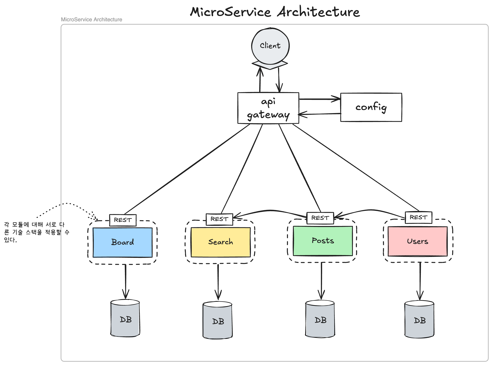

# 마이크로서비스

## 마이크로서비스의 본질
마이크로서비스는 단순히 "작은 서비스들의 집합"이 아닌, **비즈니스 도메인 경계를 중심으로 분리된 독립적인 서비스들이 API를 통해 느슨하게 결합된 분산 시스템 아키텍쳐**입니다.
각 서비스는 자체 데이터 저장소를 가지며, 독립적인 배포 라이프사이클을 따릅니다.



## 마이크로서비스의 장점

### 1. 독립적인 확장성(Scalability)
   - **선별적 스케일링**: 트래픽이 높은 특정 서비스만 확장 가능
   - **다양한 기술 스택**: 서비스별로 최적의 언어/프레임워크 선택 가능 (Java, Node.js, Go 등)

### 2. 장애 격리(Fault Isolation)
  - 한 서비스의 장애가 전체 시스템에 파급되지 않음
  - **서킷 브레이커 패턴**으로 장애 전파 방지

### 3. 개발 조직의 자율성
   - **팀의 완전한 소유권**: 설계부터 운영까지 end-to-end 책임
   - **독립적인 배포 파이프라인**: CI/CD 파이프라인이 분리되어 배포 충돌 감소

### 4. 기술 부채 관리
  - **점진적 리팩토링**: 전체 시스템 중단 없이 개별 서비스 재작성 가능
  - **기술 스택 현대화**: 서비스별 업그레이드 가능

## 마이크로서비스의 단점
### 1. 분산 시스템의 복잡성
   - **네트워크 지연과 실패**: 서비스 간 통신 시 지연 시간 발생
   - **분산 트랜잭션 관리**의 어려움

### 2. 운영 복잡도 증가
  - **배포 및 오케스트레이션**: Kubernetes, Docker Swarm 등의 도구 필요
  - **관측성(Observability)** 확보 필요

### 3. **데이터 일관성 문제**
  - **최종 일관성(Eventual Consistency)** 모델 채택 필요
  - **CQRS 패턴**을 통한 복잡한 데이터 관리

4. **테스트의 복잡성**
  - **통합 테스트**가 더 어려워짐
  - **계약 테스트(Contract Testing)** 필요

## 아키텍쳐 패턴 및 구현 전략

1. **API 게이트웨이 패턴**
  - 클라이언트와 마이크로서비스 사이의 단일 진입점
  - 요청 라우팅, 인증, 속도 제한, 캐싱 등 처리

### 2. 서비스 디스커버리
  - 동적으로 서비스 인스턴스 등록 및 발견

### 3. 이벤트 기반 아키텍쳐
  - 서비스 간 비동기 통신으로 결합도 감소

### 4. CQRS (명령 쿼리 책임 분리)
  - 읽기와 쓰기 작업을 별도 모델로 분리
  - 복잡한 도메인 로직과 쿼리 성능 최적화 동시에 달성

### 5. 데이터 관리 전략
   - **데이터베이스 per 서비스**: 각 서비스가 자체 DB 소유
   - **Saga 패턴**: 분산 트랜잭션 처리
   - **API Composition**: 여러 서비스의 데이터 조합

## 실제 예시

### 1. 넷플릭스(Netflix)

### 2. 아마존(Amazon)

### 3. 배민(Baedal Minjok)

## 마이크로서비스 채택 시 고려사항

### 1. 조직 구조 재편
  - Conway의 법칙: "시스템 설계는 조직 구조를 반영한다"
  - 기능 중심에서 제품 중심 팀으로 재구성

### 2. DevOps 문화 필수
  ```
  "You build it, you run it" - Werner Vogels (Amazon CTO)
  ```
  - 자동화된 CI/CD 파이프라인
  - 인프라스트럭처 as 코드(IaC)

### 3. 단계적 마이그레이션 전략
  - 스트랭글러 패턴(Strangler Pattern): 기존 시스템을 점진적으로 대체
  - 도메인 중심 분해: DDD(Domain-Driven Design)로 서비스 경계 식별

## 결론

마이크로서비스 아키텍쳐는 확장성, 유연성, 조직적 민첩성을 높이는 강력한 접근 방식이지만, 복잡성을 증가시키고 운영 오버헤드를 발생시킵니다.
성공적인 마이크로서비스 전략은 기술적 측면만이 아니라 조직 구조, 팀 역량, 개발 문화까지 포함하는 전체적인 접근법이 필요합니다.
마이크로서비스 도입은 모놀리스에서 발생하는 문제가 명확할 때 시작하는 것이 바람직하며, "마이크로서비스를 위한 마이크로서비스" 구현은 피해야 합니다.
궁극적으로 비즈니스 가치 창출을 가속화하고 고객 요구사항에 빠르게 대응할 수 있는 아키텍쳐 접근법을 선택하는 것이 중요합니다.
