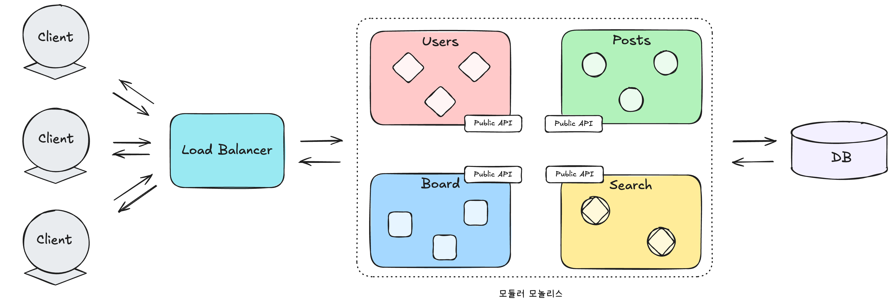
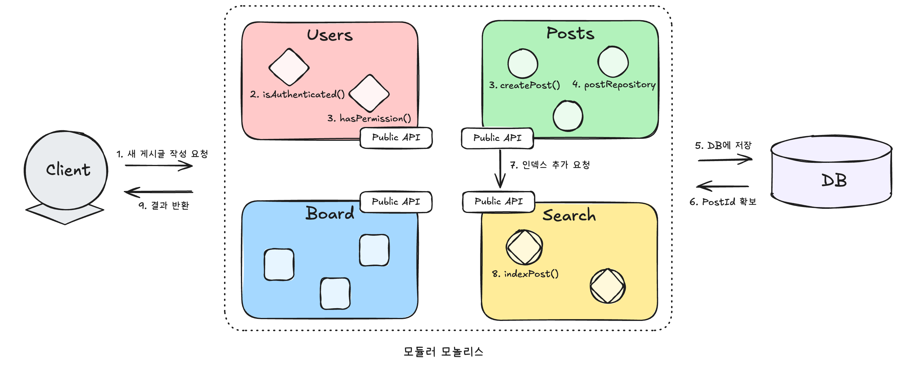
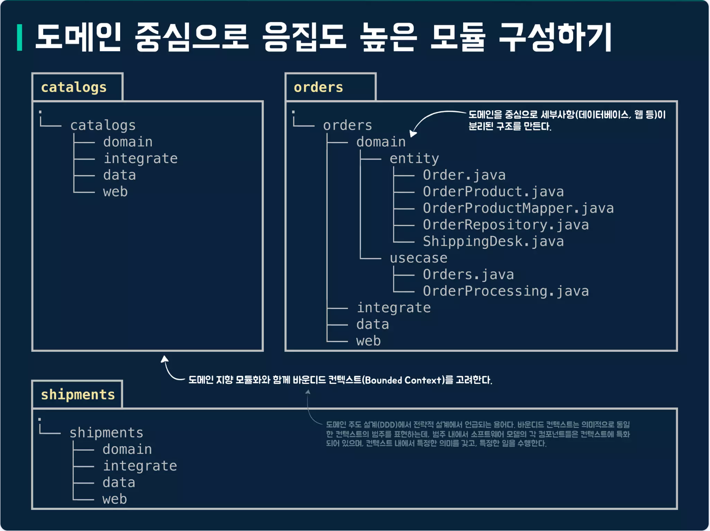
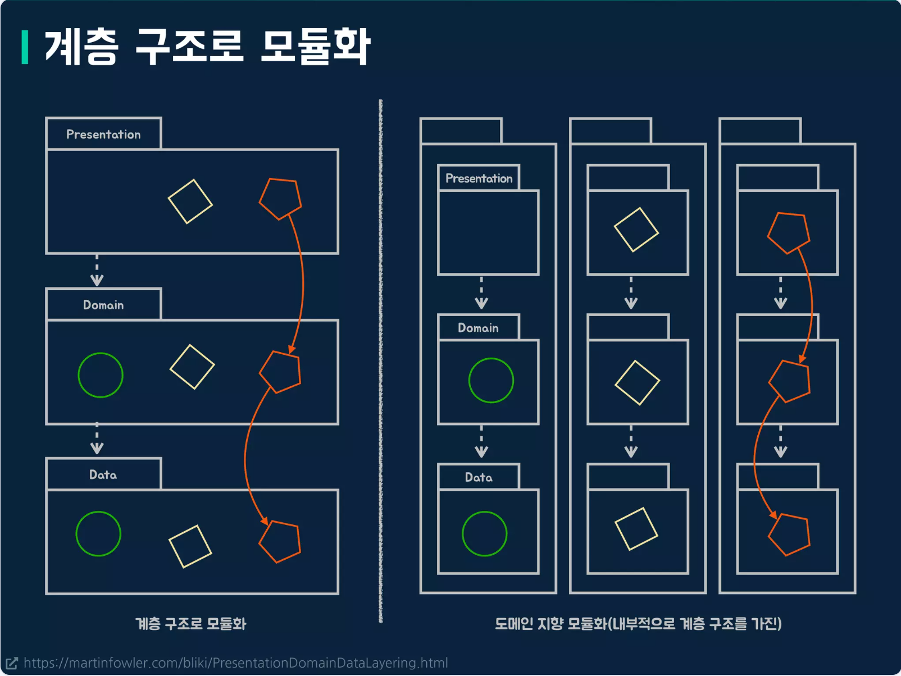
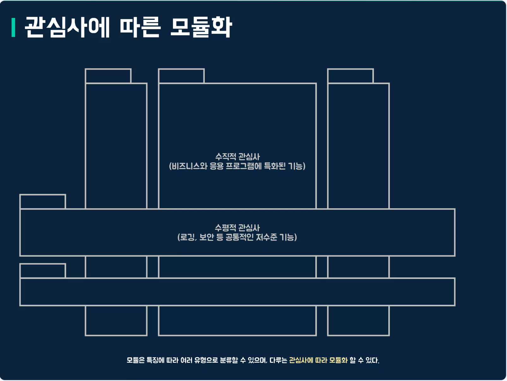

# Modular Monolith(모듈러 모놀리스)

## Modular Monolith란?
애플리케이션을 **독립적인 모듈 또는 컴포넌트**로 구성하되, 이 모든 모듈이 **단일 코드베이스와 런타임 환경** 내에서 통합되어 운영되는 아키텍처 패턴입니다.
각 모듈은 특정 로직이나 도메인 기반 설계 원칙에 따라 명확한 경계를 가지고 조직화됩니다. 이로 인해 시스템의 응집도를 높이고 모듈성을 향상시키는 것을 목표로 합니다.



## 모듈러 모놀리스의 특징

### 1. 모듈성
- 애플리케이션을 작고 독립적인 모듈로 분할
- 각 모듈은 특정 기능 또는 비즈니스 도메인에 대한 책임을 가짐

### 2. 긴밀한 통합
- 모든 모듈이 **단일 코드베이스**와 런타임 환경 내에서 통합되어 운영

### 3. 공유 코드베이스 및 데이터
- 모든 모듈이 공유하는 코드베이스와 데이터를 사용하여 일관성을 유지
- 단, 데이터 격리 전략에 따라 데이터베이스 스키마 또는 데이터베이스 자체를 분리 할 수 있음

### 4. 공용 API를 이용한 통신
- 모듈 간의 통신은 공용 API를 통해 이루어져, 서로 다른 모듈 간의 **의존성을 줄임**

## 모듈러 모놀리스의 장점

### 1. 단순화된 배포
- 마이크로서비스와 달리 여러 서비스의 복잡한 배포 전략 및 오케스트레이션이 필요 없이 단일 유닛으로 배포할 수 있어 배포 및 관리와 관련된 복잡성과 오버헤드를 크게 줄여줍니다.
- 이는 특히 복잡한 아키텍처에 익숙하지 않은 팀이나 아직 마이크로서비스 수준의 확장성을 요구하지 않는 애플리케이션에 큰 이점입니다.

### 2. 향상된 성능
- 모듈 간의 통신이 네트워크를 통하지 않고 프로세스 내에서 직접 이루어지기 때문에 마이크로서비스 아키텍처에서 발생하는 네트워크 지연이나 데이터 직렬화 및 역직렬화의 오버헤드가 없습니다.
이는 낮은 지연 시간을 요구하는 애플리케이션에 매우 중요할 수 있습니다.

### 3. 개발 속도 향상 (초기 단계)
- **단일 코드베이스**를 관리하므로 개발 팀은 더 빠른 속도로 개발을 진행할 수 있습니다.
모든 코드가 한 곳에 있으므로 디버깅이 간단해지고, 여러 마이크로서비스 저장소 간의 변경 사항을 조정하는 복잡성이 줄어듭니다.
이는 프로젝트 초기 단계나 소규모 팀에게 특히 유리합니다.

### 4. 쉬운 트랜잭션 관리
- 일반적으로 동일한 데이터베이스를 공유하므로 표준 ACID 속성을 사용하여 모듈 간의 트랜잭션을 보다 간단하게 관리할 수 있습니다.
마이크로서비스 환경에서의 분산 트랜잭션은 구현 및 관리가 매우 복잡할 수 있으므로, 이는 중요한 이점입니다.

### 5. 낮은 운영 복잡성
- 분산된 마이크로서비스 시스템에 비해 관리, 모니터링, 문제 해결해야 할 요소가 적어 운영 오버헤드가 줄어듭니다.
이는 인프라 비용 절감 및 운영 환경의 단순화로 이어집니다.

### 6. 마이크로서비스로의 쉬운 전환
- 잘 설계된 모듈형 모놀리스는 필요에 따라 개별 모듈을 별도의 서비스로 추출하여 마이크로서비스 아키텍처로 점진적으로 전환할 수 있는 명확하고 쉬운 경로를 제공합니다.
이는 전통적인 모놀리스에서 마이크로서비스로의 완전한 재작성에 비해 위험과 복잡성을 줄여줍니다.

### 7. 높은 응집도와 낮은 결합도
- 모듈 내에서는 관련된 기능들을 함께 그룹화하고, 모듈 간의 의존성을 최소화하도록 설계되어 코드베이스의 유지보수성과 이해도를 높입니다.

### 8. 데이터 캡슐화 용이
- 모듈 간의 명확한 경계는 한 모듈이 다른 모듈의 내부 데이터 구조에 직접 접근하는 것을 방지하여 데이터 캡슐화를 향상시키고 의도치 않은 부작용의 위험을 줄입니다.

### 9. 비즈니스 기능 중심의 조직화
- 코드베이스를 비즈니스 도메인 또는 기능 중심으로 구성하여 시스템을 비즈니스 요구 사항에 더 쉽게 이해하고 발전시킬 수 있도록 합니다.
카밀 그지벡은 이러한 설계를 "수직적 슬라이스(Vertical Slices)"라고 부르며, 비즈니스 모듈과 수직적 슬라이스를 모듈형 모놀리스의 핵심으로 강조합니다.

### 10. 향상된 확장성 (기존 모놀리스 대비)
- **전체 애플리케이션이 함께 배포**되지만, 필요에 따라 개별 모듈을 독립적으로 확장할 수 있어 기존 모놀리스에 비해 더 나은 확장성을 제공합니다.
이는 특정 모듈에 부하가 집중될 때 전체 애플리케이션을 확장하는 비효율성을 줄여줍니다.

---

## 모듈러 모놀리스의 단점

### 1. 복잡성 관리
- 애플리케이션의 규모와 복잡성이 증가함에 따라 모듈 간의 상호 작용을 관리하고 코드베이스 전체의 일관성을 유지하는 것이 어려워질 수 있습니다.
모듈 경계가 제대로 정의되지 않거나 모듈 간 의존성이 과도하게 많아지면 복잡성이 증가할 수 있습니다.

### 2. 의존성 관리
- 모듈 간의 의존성을 관리하고 순환 의존성을 피하는 데 어려움이 있을 수 있습니다. 이는 신중한 아키텍처 설계와 특정 기술 (예: 의존성 역전)의 적용을 요구합니다.
제대로 관리되지 않은 의존성은 모듈 간의 강한 결합을 초래하여 모듈성의 이점을 퇴색시킬 수 있습니다.

### 3. 배포 복잡성 (기존 모놀리스 대비)
- **단일 배포 아티팩트**이지만, 개별 모듈이 특정 배포 구성을 요구하거나 배포 간의 조율이 필요한 경우 기존 모놀리스보다 배포가 더 복잡해질 수 있습니다.
빌드 프로세스 및 통합 테스트의 중요성이 더욱 강조됩니다.

### 4. 테스트 오버헤드
- 개별 모듈에 대한 테스트뿐만 아니라 모듈 간의 상호 작용에 대한 테스트도 필요하므로 테스트 노력이 증가할 수 있습니다.
모듈들이 함께 작동하는 방식을 보장하기 위해서는 포괄적인 통합 테스트가 필수적입니다.

### 5. "분산 모놀리스"의 위험
- 잘못된 경계 정의로 인해 모듈들이 분리되어 있음에도 불구하고 과도하게 통신하거나 강하게 결합되어 있다면, 마이크로서비스의 이점 없이 분산 시스템과 유사한 문제점을 야기할 수 있습니다. 이는 비즈니스 도메인에 대한 깊은 이해와 신중한 경계 정의의 중요성을 강조합니다.

### 6. 데이터 격리의 어려움
- 특히 단일 데이터베이스로 시작하는 경우 모듈 간의 완전한 데이터 격리를 보장하는 것은 기술적으로 어려울 수 있습니다. 다양한 수준의 데이터 격리 전략은 서로 다른 복잡성과 장단점을 수반합니다.

### 7. 확장성 및 기술 다양성의 제약
- 마이크로서비스와 비교했을 때, 어느 정도의 모듈별 확장이 가능할 수 있지만, 마이크로서비스만큼 세밀하지는 않습니다. 또한, 일반적으로 모든 모듈은 동일한 기술 스택을 공유합니다. 따라서 이러한 요소들이 중요한 요구 사항이라면, 처음부터 마이크로서비스를 고려하는 것이 더 적절할 수 있습니다. 

## 모듈러 모놀리스 예시


## 통신 패턴
### 1. 동기식 메서드 호출
- 모듈 간의 public API를 통해 노출된 메서드를 직접 호출하는 방식
- 모듈 내부의 구현 세부 정보는 접근 제어자를 통해 숨길 수 있다.
- **장점** : 속도가 빠르고 구현이 간단, 중간 매개체 없어도 됨.
- **단점** : 모듈간의 강한 결합을 초래, 장애 전파 가능성이 있음

### 2. 비동기식 메시징
- 메세지 브로커를 통해 모듈 간의 비동기식 통신을 수행하는 방식
- 모듈 간의 결합도를 줄이고, 장애 전파를 방지할 수 있다.
- **장점** : 느슨한 결합, 장애 전파 방지, 비동기 처리 가능
- **단점** : 메세지 브로커 도입으로 인한 구현 복잡성 증가, 메시지 브로커 필요, 성능 저하 가능성


## 모듈화 방법
### 1. 도메인 주도 설계(DDD)



- 비즈니스 도메인에 따라 모듈화
    ```
    com.co2plant.blog
    └── post/                         # Post 바운디드 컨텍스트
        ├── api/                      # 외부에 노출되는 인터페이스
        │   ├── PostController.java
        │   ├── PostDto.java
        ├── domain/                   # 핵심 도메인 모델
        │   ├── Post.java             # 애그리게이트 루트
        │   ├── PostContent.java      # 값 객체
        ├── application/              # 유스케이스 구현
        │   ├── PostService.java      # 애플리케이션 서비스
        │   ├── command/
        │   │   ├── CreatePostCommand.java
        │   │   └── PublishPostCommand.java
        │   └── event/
        │       └── PostPublishedEvent.java
        └── infrastructure/           # 기술적 구현
            ├── PostRepository.java   # 레포지토리 인터페이스
            ├── JpaPostRepository.java # 구현체
            └── PostMapper.java
    ```

### 2. 계층 구조로 모듈화



- 기술적 관심사를 기준으로 수평적 계층 구조로 모듈화
    ```
    com.co2plant.blog
    ├── controller/              # 프레젠테이션 계층
    │   ├── PostController.java
    │   └── dto/
    │       ├── PostRequestDto.java
    │       └── PostResponseDto.java
    ├── service/                 # 비즈니스 로직 계층
    │   └── PostService.java
    ├── repository/              # 데이터 액세스 계층
    │   ├── PostRepository.java
    │   └── TagRepository.java
    └── model/                   # 데이터 모델
        ├── Post.java
        └── Tag.java
    ```
### 3. 관심사에 따른 모듈화



- 기능이나 관심사에 따라 모듈화
    ```
    com.co2plant.blog
    ├── post/                    # 기능적 관심사
    │   ├── PostController.java
    │   ├── PostService.java
    │   ├── PostRepository.java
    │   └── Post.java
    ├── security/                # 횡단 관심사: 보안
    │   ├── SecurityConfig.java
    │   └── PostAuthorizationAspect.java
    ├── logging/                 # 횡단 관심사: 로깅
    │   └── LoggingAspect.java
    ├── caching/                 # 횡단 관심사: 캐싱
    │   └── PostCacheConfig.java
    └── common/                  # 공통 기능
        ├── exception/
        ├── validation/
        └── pagination/
    ```


# 결론
## 모듈러 모놀리스가 추구하는 방향


모듈러 모놀리스는 모놀리틱과 마이크로서비스 사이에 존재하는 아키텍처이며, 이름그대로 **모듈화 된 모놀리틱**입니다.
모듈러 모놀리스는 모놀리틱 아키텍처의 장점(단순성, 견고함)과 마이크로서비스 아키텍처(유연성 확장성)의 장점을 결합하여, 단일 코드베이스 내에서 모듈 간의 느슨한 결합과 높은 응집도를 유지하면서도, 배포 및 운영의 복잡성을 줄이는 것을 목표로 합니다.
다만 단점도 결합하여 존재하므로 적절한 아키텍처를 선택하는 것이 중요합니다.
