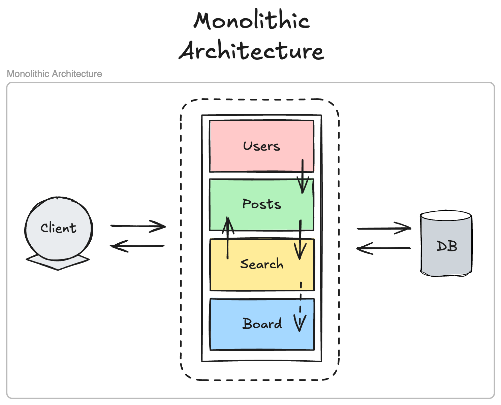

# Monolithic Architecture(모놀리식 아키텍쳐)

## 모놀리식 아키텍처란?
모놀리식 아키텍처는 단순히 "모든 기능이 하나의 애플리케이션에 있는 구조"를 넘어, **단일 코드베이스, 단일 프로세스, 단일 배포 단위로 구성된 애플리케이션 아키텍처 패턴**입니다.
모든 비즈니스 로직, 데이터 액세스 계층, UI/UX 컴포넌트가 하나의 프로그램으로 결합되어 있습니다.



## 모놀리식 아키텍처의 장점
### 1. 컨텍스트 전환 비용 제로
   - 함수 호출을 통해 모든 모듈 간 통신이 이루어지므로 네트워크 지연이나 직렬화/역직렬화 오버헤드가 없음
   - 예: Java 애플리케이션에서 결제 처리 로직이 상품 관리 로직을 직접 호출 가능

### 2. 트랜잭션 관리 용이성
   - 분산 트랜잭션의 복잡성 없이 단일 데이터베이스 트랜잭션으로 여러 비즈니스 로직을 묶을 수 있음
      ```java
      @Transactional
      public void processOrder(OrderDto order) {
         // 재고 확인, 주문 생성, 결제 처리, 배송 준비 등이 하나의 트랜잭션으로 처리
         inventoryService.checkStock(order.getItems());
         Order savedOrder = orderRepository.save(new Order(order));
         paymentService.processPayment(order.getPayment(), savedOrder.getId());
         shippingService.scheduleDelivery(savedOrder);
      }
      ```

### 3. 메모리 공유 효율성
   - 캐싱 레이어를 별도로 구축할 필요 없이 JVM 내 메모리에서 직접 공유 가능
   - 예: Redis나 Memcached 같은 외부 캐시 시스템 없이도 애플리케이션 내부 캐싱 활용 가능

### 4. 개발 환경 설정 단순화
   - 로컬 개발 시 하나의 애플리케이션만 실행하면 되어 진입 장벽이 낮음
   - IDE에서 전체 코드베이스를 쉽게 탐색하고 디버깅 가능

## 모놀리식 아키텍처의 단점
### 1. 확장성 제한
   - **수직적 확장만 가능**: CPU, 메모리 증설로만 성능 향상 가능
   - **비균등 부하 처리 어려움**: 특정 기능(예: 이미지 처리)만 많은 리소스를 소비해도 전체 애플리케이션 확장 필요 

### 2. 기술적 부채 누적
   - **경계 모호화**: 시간이 지남에 따라 잘 정의된 모듈 경계가 무너지는 경향
   - **코드 오염**: 한 도메인의 변경이 의도치 않게 다른 도메인에 영향을 미침
      ```java
      // 주문 서비스에서 무의식적으로 상품 서비스 내부 구현에 의존하는 예
      public class OrderService {
         public void createOrder(Long productId) {
            Product product = productRepository.findById(productId).orElseThrow();
            // 상품 서비스의 내부 구현 세부사항에 직접 접근 - 캡슐화 위반
            if (product.getInternalStatus() == ProductStatus.AVAILABLE) {
               // 주문 로직...
            }
         }
      }
      ```

### 3. 장애 격리 부재
   - 메모리 누수, CPU 과부하 등의 문제가 전체 시스템에 영향을 미침
   - 하나의 API 엔드포인트에 DDoS 공격이 들어오면 전체 애플리케이션 다운 가능성

### 4. 기술 스택 제약
   - 전체 애플리케이션이 단일 언어와 프레임워크로 구성되어야 함
   - 특정 기능에 최적화된 다른 언어/프레임워크 사용 불가

## 모놀리스 현대화 경로

### 1. 점진적 모듈화
   - 도메인 주도 설계(DDD)를 적용하여 바운디드 컨텍스트 식별
   - 모듈 간 의존성을 명시적으로 관리하고 순환 의존성 제거

### 2. 마이크로서비스로의 전환 준비
   - API 게이트웨이 패턴 도입
   - 도메인 이벤트 기반 아키텍처로 전환하여 결합도 감소
   ```java
      @Service
      public class OrderCompletionService {
         private final EventPublisher eventPublisher;
         
         public void completeOrder(Order order) {
            // 주문 처리 로직
            
            // 이벤트 발행을 통한 느슨한 결합
            eventPublisher.publish(new OrderCompletedEvent(order.getId()));
         }
   }
   ```

### 3. 스트랭글러 패턴(Strangler Pattern)
   - 레거시 모놀리스를 점진적으로 새로운 아키텍처로 이전하기 위한 전략
   - 기존 기능을 하나씩 분리하여 새 서비스로 마이그레이션

## 모놀리스가 여전히 유효한 상황

1. **스타트업 초기 단계**
   - 제품-시장 적합성(Product-Market Fit)을 찾는 과정에서 빠른 개발 속도 우선

2. **비즈니스 도메인이 고도로 통합된 경우**
   - 데이터와 프로세스가 긴밀하게 연결되어 분리가 비효율적인 경우

3. **운영 오버헤드 최소화 필요 시**
   - 소규모 팀이 관리하는 중소 규모의 애플리케이션

## 결론
모놀리식 아키텍처는 단순히 "레거시" 또는 "구식"일 수 있지만, 특정 상황에서 합리적인 아키텍처 선택이 될 수 있습니다. 
핵심은 비즈니스 요구사항, 팀 구조, 확장성 요구 사항을 고려한 균형 잡힌 접근법입니다. 
모듈성을 유지하면서 모놀리스의 장점을 취하는 "모듈러 모놀리스" 방식이 최근 주목받는 이유이기도 합니다.
최신 도구와 방법론을 활용하면 모놀리식 애플리케이션의 많은 단점을 완화할 수 있으며, 필요에 따라 마이크로서비스로의 점진적 전환 경로를 확보할 수 있습니다.
