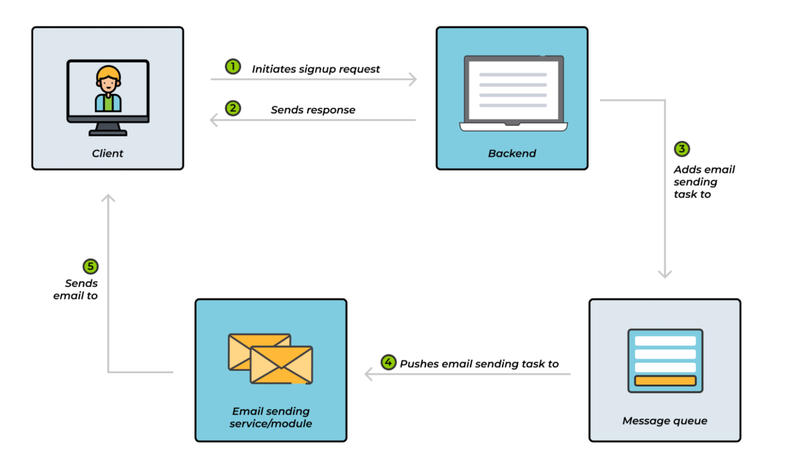

### 0\. 메시지 큐란 무엇인가?

| 구분        | 설명                                                                                                         |
| --------- | ---------------------------------------------------------------------------------------------------------- |
| **정의**    | 생산자(Producer)가 보낸 메시지를 **임시로 버퍼링**해 두었다가 수신자(Consumer)가 준비되면 전달하는 미들웨어                                     |
| **주요 효과** | 즉시 응답이 필요 없는(혹은 불가능한) 작업을 큐에 적재함으로써 서비스 간 결합도를 낮추고 부하를 완충 ① **느슨한 결합** – 요청·응답의 시간 의존성 제거 ② **부하 완충** – 트래픽 스파이크 흡수 ③ **신뢰성** – 디스크 퍼시스턴스·ACK/NACK으로 메시지 유실 방지 |
| **동작**    | `Producer → Queue(FIFO) → Consumer`                                                                        |
| **패턴**    | 워크 큐, 브로드캐스트, RPC, 스트리밍, IoT 등                                                                             |

> **우체국 비유**  
> 편지 = 메시지, 우체통 = 큐, 집배원(브로커)이 대신 보관·전달
>
> 발신자·수신자가 동시에 깨어 있을 필요가 없다.

### 1\. 메세지 큐 전체 흐름

| 번호    | 단계                              | 상세 설명                                        | 메시지 큐의 가치                |
| ----- | ------------------------------- | -------------------------------------------- | ------------------------ |
| **①** | **클라이언트가 회원가입 요청**              | 사용자가 가입 폼 제출 → 백엔드로 HTTP 요청                  | –                        |
| **②** | **백엔드, 즉시 HTTP 응답**             | “가입 완료” JSON 반환 → 사용자 UX 지연 최소화              | **실시간 응답** 확보            |
| **③** | **백엔드 → 메시지 큐에 ‘이메일 발송 작업’ 등록** | `signup.welcome` 같은 라우팅 키로 메시지 큐에 푸시         | 과부하 시에도 **작업 유실 X**      |
| **④** | **이메일 서비스가 큐에서 작업 꺼냄**          | Consumer(이메일 모듈)가 `basicConsume()` 으로 비동기 수신 | **부하 분산**·재시도 용이         |
| **⑤** | **이메일 발송 후 완료**                 | SMTP 발송 성공 → 사용자에게 실제 메일 도착                  | 비즈니스 로직과 **메일 전송 로직 분리** |
 

### 2\. 메세지 큐의 효과

- 메세지 큐를 사용하면 즉시 응답 (②) 과 지연 작업 (③-⑤) 을 분리해 UX · 성능 · 신뢰성을 모두 확보

- 이메일 발송 모듈이 잠시 다운돼도 메시지는 큐에 안전하게 남아 복구 후 재처리

- 동일 큐에 컨슈머를 수평 확장하면 높은 메일 트래픽도 탄력 처리 가능

메시지 큐를 사용하면 **“사용자 요청 → 실시간 응답”** 과 **“무거운 후처리 작업”** 을 깔끔히 분리할 수 있다. RabbitMQ, Kafka, SQS 등 구현체가 다양하지만 개념은 동일하다.

### 3\. 메세지 큐 미사용(동기 처리) vs 메세지 큐 사용(비동기 처리)

| 단계    | 메시지 브로커 **미사용** (동기 처리)              | 메시지 브로커 **사용** (비동기 처리)           |
| ----- | ------------------------------------ | --------------------------------- |
| **1** | 사용자: **“보내기” 클릭**                    | 사용자: **“보내기” 클릭**                 |
| **2** | 서버: 입력값(수신자‧제목 등) **유효성 검사**         | 서버: 입력값(수신자‧제목 등) **유효성 검사**      |
| **3** | 서버: **첨부파일 바이러스 검사** ‒ 사용자 **대기** | 서버: **메일 발송 요청 메시지**를 **큐에 저장**   |
| **4** | 서버: **SMTP 발송 요청** ‒ 사용자 **대기**   | 서버: 사용자에게 **즉시 응답** “발송 요청 접수” |
| **5** | 서버: **SMTP 발송 결과 대기**                | 워커: 큐에서 메시지 꺼내 **바이러스 검사**        |
| **6** | 서버: 사용자에게 **발송 성공/실패** 응답            | 워커: **SMTP 발송 요청** → 결과 **저장/알림** |
| **7** | **끝**                                | 워커: (필요 시) 사용자에게 발송 결과 **푸시 알림**  |
| **8** | ―                                    | **끝**                             |

>그런데, 메세지 브로커 사용 안해도 내부적으로 비동기작업하면 즉시 응답하면서 오래걸리는 작업을 분리할 수 있지 않나? 
내부 쓰레드로 비동기처리를 하면 즉시 응답과 지연 작업을 분리할 수 있다. 
하지만, 메세지 큐는 큰 규모의 서비스에서 다음과 같은 장점이 있다.

### 4\. 내부 비동기 vs 메세지 브로커 기반 비동기

| **항목**          | **내부 비동기 (스레드·태스크 등)**      | **메시지 브로커 기반 비동기**                 |
| --------------- | ------------------------------ | ---------------------------------- |
| **즉시 응답**       | ✔️ 가능 – 메인 스레드가 바로 HTTP 응답 반환  | ✔️ 가능 – 요청만 큐에 적재 후 즉시 응답          |
| **장애 시 메시지 보존** | ❌ 서버 프로세스·메모리 사라지면 작업 유실 위험    | ✔️ 브로커가 디스크·클러스터에 메시지 저장 (Durable) |
| **확장성**         | 제한적 – **단일 인스턴스 내부** 스레드 수에 의존 | 우수 – 워커 인스턴스를 **수평 확장**해 대량 처리     |
| **서비스 결합도**     | 높음 – 작업 로직이 **애플리케이션과 긴밀 결합**  | 낮음 – 큐를 사이에 두고 **느슨하게 연결**         |
| **신뢰성**         | 낮음 – 서버 다운 시 비동기 작업 사라질 수 있음   | 높음 – 장애 후 재시작해도 **메시지 재처리** 가능     |
| **운영 복잡도**      | 간단 – 별도 인프라 불필요                | 복잡 – **브로커 설치·모니터링** 필요, 아키텍처 추가   |
