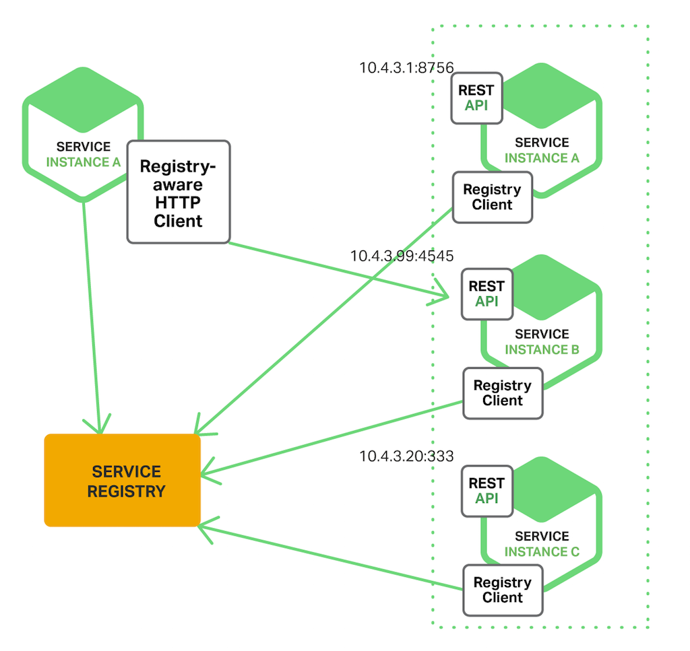

# 서비스 디스커버리 (Service Discovery)

## 1. Service Discovery란
서비스 디스커버리(Service Discovery)는 **마이크로서비스 환경에서 서비스의 위치(IP, 포트)를 자동으로 등록하고 찾는 기능**

마이크로서비스는 독립적으로 배포되고 실행되기 때문에, 각각의 위치를 고정할 수 없으며 **동적으로 변하는 서비스들을 어떻게 연결할 것인지**가 중요한 문제

## 2. 왜 필요한가?

서비스는 일반적으로 서로를 호출 → 서비스 간 통신을 위해서는 **서로의 위치(IP/Port)** 필요

### 전통적인 애플리케이션
- 주로 **물리적인 하드웨어나 단일 서버 환경에서 실행**
- 인스턴스의 네트워크 위치(IP/포트)가 **고정**
- 각 서비스 간 통신이 **비교적 단순**

### 현대의 클라우드 기반 MSA
- 서비스 인스턴스가 실행될 때마다 **동적으로 IP/포트를 할당**
- **오토스케일링**, **롤링 배포**, **장애 복구** 등의 이유로 서비스 인스턴스의 수와 위치가 **수시로 변경**

따라서 Client가 서비스를 호출하기 위한 서비스를 찾는 매커니즘 **(service discovery mechanism)** 필요

## 3. Client-side Discovery

Client가 **직접 Service Registry에 요청하여** 대상 서비스의 위치를 알아내고, 그 위치로 요청을 보내는 방식

### 🔁 동작 흐름
1. Client가 **Service Registry**에 서비스 위치를 요청
2. Service Registry는 해당 서비스 이름으로 등록된 **IP/Port 목록**을 Client에게 응답
3. Client는 받은 목록 중 하나를 선택해 **직접 대상 서비스로 요청**

### ✅ 장점
- 구현 쉬움

### ❌ 단점
- 각 서비스별로 다른 서비스를 검색하는 로직을 언어 및 프레임워크 별로 구현해야함
- Service registry의 변경사항이 모든 서비스 구현에 영향을 줌

### 📦 실제 사용 예시: Netflix Eureka + Ribbon  

## 4. Server-side Discovery

Client대신 **게이트웨이나 프록시**가 서비스 위치를 찾아서 요청을 전달하는 방식

### 🔁 동작 흐름
1. Client가 **게이트웨이 또는 프록시**에 요청  
2. 게이트웨이 또는 프록시가 **Service Registry**에서 대상 서비스의 위치를 조회  
3. 조회된 위치(IP/Port)를 바탕으로 **대상 서비스에 요청을 전달하고**,  
**응답을 받아 Client에게 다시 전달**

### ✅ 장점
- discovery 구현의 세부사항이 client로부터 캡슐화 되어있음
- client입장에서 서비스 검색 로직을 구현할 필요 없음
- 언어에 구애받지 않음
- 서비스와 Registry사이에 결합이 필요하지 않음

### ❌ 단점
- 인프라(프록시, Gateway, Registry 등) 구축 필요

### 📦 실제 사용 예시: Kubernetes + Ingress

## 5. The Self‑Registration Pattern

서비스 인스턴스가 **자신의 위치 정보를 직접 Service Registry에 등록**하는 방식

### ✅ 장점
- 최적의 시기에 서비스 레지스트리에 알릴 수 있음 (서비스 자체가 현재 상태에 대한 매우 세부적인 정보를 알고있기 때문)

### ❌ 단점
- 서비스가 중단되거나 응답하지 않는 경우, Service Registry를 업데이트 할 수 없어 오래된 것이 남아있음
- 모든 언어에 대한 구현 필요

## 6. The Third‑Party Registration Pattern

서비스 등록자 라는 다른 시스템 구성 요소가 등록을 처리

### ✅ 장점
- 언어에 구애받지 않음
- 서비스가 중단되거나 응답하지 않더라도 서비스 등록자가 Service Registry 업데이트

### ❌ 단점
- 오케스트레이션 엔진 외부에 배포된 서비스는 Service Registry에 자동으로 등록되지 않음  
  → 오케스트레이션 엔진: 컨테이너나 서비스를 자동으로 실행하고 관리하는 시스템 (예: Kubernetes)

## 참고
- [egov msa service discovery](./egov-msa-service-discovery.md)
- Service Discovery in a Microservices Architecture
  - https://www.f5.com/company/blog/nginx/service-discovery-in-a-microservices-architecture 
- MSA School 서비스 디스커버리 패턴
  - https://www.msaschool.io/operation/design/design-six/
- A Dev' Story 유튜브 채널의 What is Service Discovery?
  - https://www.youtube.com/watch?v=v4u7m2Im7ng
