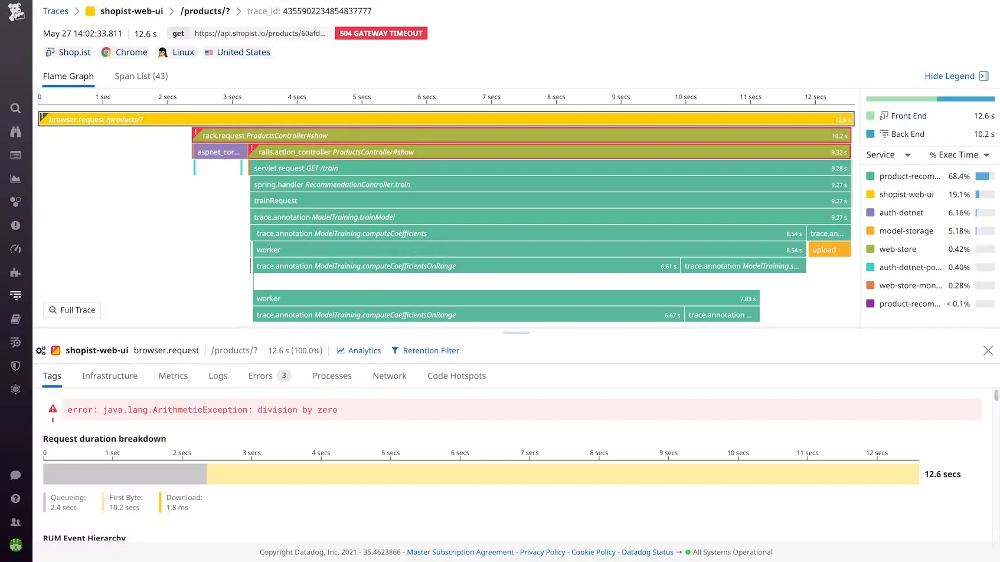
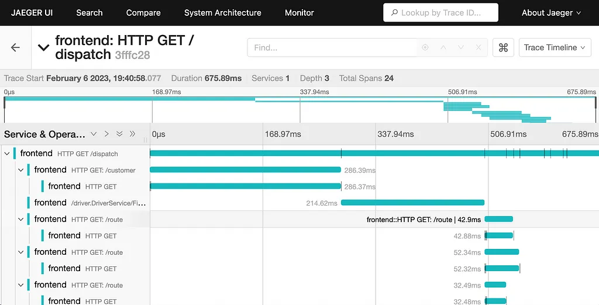

## **1. Observability의 개요**

IT 시스템이 점점 복잡해지는 지금, 단순히 모니터링만으로는 문제의 원인을 정확히 파악하기 어렵습니다.

그래서 등장한 개념이 Observability입니다.

### **1.1 Observability의 정의**

Observability란 시스템의 내부 상태를 외부에서 보이는 데이터를 통해 유추할 수 있는 능력을 말합니다.

이 개념은 사실 IT 분야에서 새롭게 탄생한 것이 아닙니다.

1959년 헝가리계 미국인 과학자 루돌프 칼만(Rudolf E. Kálmán)이 "제어 시스템의 일반 이론(On the General Theory of Control Systems)"이라는 논문에서 처음 소개했습니다.

당시 칼만은 제어 이론의 맥락에서 "측정 가능한 변수들로부터 측정 불가능한 상태 변수를 재구성하는 개념"으로 Observability를 정의했습니다.

오늘날 IT 분야에서는 이 개념이 "시스템이 생성하는 외부 출력(로그, 메트릭, 트레이스)을 통해 내부 상태를 이해하는 능력"으로 진화했습니다.

즉, 문제를 "미리 감지하고", "원인을 추적하며", "빠르게 대응"할 수 있도록 도와줍니다.

### **1.2 왜 중요한가?**

마이크로서비스, 컨테이너, 클라우드 네이티브 환경에서는 서비스가 빠르게 바뀌고 복잡성이 증가합니다.

- ex) 400개 이상의 파드와 100개의 노드가 존재하는 분산 시스템 환경에서 전체 애플리케이션의 포괄적인 뷰를 얻는 것이 매우 어렵습니다.

**예측할 수 없는 장애(unknown-unknowns)에 빠르게 대응하려면 관찰 가능성이 핵심**입니다.

- 전통적인 모니터링 방식은 예상된 문제만 감지할 수 있지만, Observability는 예상치 못한 이슈까지 조사할 수 있습니다.

### **1.3 역사적 발전**

초기에는 로그 기반의 단순 모니터링이 주였지만,

시스템이 분산되고 비동기화되면서 메트릭과 트레이싱의 중요성이 커졌고,

이후 OpenTracing, OpenCensus → OpenTelemetry와 같은 표준이 등장하면서 Observability는 하나의 문화이자 전략으로 발전했습니다.

과거에는 저장 비용이 높아 압축 및 집계된 데이터 포인트만 저장했지만, 시간 경과에 따라 시계열 데이터베이스(TSDB)의 등장으로 더 효율적인 비용으로 더 많은, 더 자세한 데이터를 저장할 수 있게 되었습니다.

이는 현대적 Observability의 기반이 되었습니다.

## **2. Observability vs Monitoring**

### **2.1 전통적인 모니터링**

- CPU, 메모리 사용량, 에러 카운트와 같은 고정된 지표를 수집
- 주로 알람과 대시보드 중심
- 문제가 발생하면 "결과"는 알 수 있지만 "원인"은 모르는 경우가 많음

예시: 웹서버 CPU가 90%를 초과하면 알림이 발생하지만, 왜 그런지는 알려주지 않습니다. (사용자 증가? 메모리 누수? 비효율적인 쿼리?)

### **2.2 Observability의 차별점**

- 다양한 출처의 데이터를 통합적으로 분석
- 고정된 지표가 아니라 "질문에 답할 수 있는 시스템"
    - ex) 사용자가 에러를 만났을 때 어느 서비스에서 병목이 있었는지 추적 가능
- Observability는 단순히 "무엇이" 일어났는지가 아니라 "왜" 일어났는지에 초점을 맞춘다.,

예시: 특정 사용자의 결제 트랜잭션이 실패했을 때, 해당 요청이 거쳐간 모든 서비스를 추적하고 어느 단계에서 어떤 이유로 지연 또는 실패가 발생했는지 정확히 파악할 수 있습니다.

## **2.3 주요 차이점 (표)**

| **항목** | **Monitoring** | **Observability** |
| --- | --- | --- |
| 목적 | 알려진 문제 감지 | 알려지지 않은 문제 탐지 및 분석 |
| 방식 | 정형화된 메트릭 수집 | 로그, 메트릭, 트레이싱 종합 |
| 대응 | 알람 기반 대응 | 인과관계 분석 및 근본 원인 파악 |
| 인프라스트럭처 | 전통적인 데이터센터 환경에 적합 | 클라우드 환경 및 현대 인프라에 최적화 |
| 인과관계 | 이벤트와 메트릭 간의 상관관계 제공 | 인과관계 확립에 중점 |
| 세분성 | 호스트에 설치된 에이전트를 통해 외부에서 내부를 관찰 | 코드 수준에서 계측되어 더 높은 세부 정보 제공 |

### **3. Observability의 3대 기둥 (3 Pillar)**

Observability는 세 가지 핵심 요소로 구성됩니다.

### **3.1 로그 (Logging)**

- 로깅은 애플리케이션이나 시스템 내에서 이벤트, 오류, 활동을 체계적으로 기록하는 데이터이다.
- 각 로그 항목은 특정 시점의 시스템 상태에 대한 컨텍스트와 정보를 제공합니다.
    - 정형/비정형 텍스트 데이터
        - ex) 에러 메시지, 사용자 요청 로그 등
- 컨텍스트 파악에 유용하지만 양이 많고 분석이 어려울 수 있음

<aside>
💡

ex) 사용자 로그인 시도 실패 시 "사용자 ID 12345, 실패 원인: 비밀번호 5회 오류, IP 주소: 123.456.789.0, 시간: 2025-05-20 01:23:45 KST"와 같은 상세 정보를 로그에 기록합니다.

</aside>

### **3.2 지표 (Metrics)**

- 메트릭은 시스템 성능과 Healthy/Unhealthy에 대한 통찰력을 제공하는 수치 기반 데이터이다.
    - 숫자 기반 시계열 데이터
        - ex) 요청 수, 응답 시간, CPU 사용량
    - 모니터링과 경보 시스템에 적합
- 일반적으로 집계되어 시계열 형식으로 저장되며, 시간 경과에 따른 추세를 분석하는 데 유용하다.

<aside>
💡

"지난 5분간 결제 API의 평균 응답 시간: 120ms, 95번째 백분위 응답 시간: 350ms, 오류율: 0.5%, 초당 요청 수: 250"과 같은 정량적 데이터를 지속적으로 수집합니다.

</aside>

### **3.3 트레이싱 (Tracing)**

- 트레이싱은 서비스와 서비스간의 요청 흐름을 추적하는 데이터이다.
    - 분산 시스템에서 A → B → C로 이어지는 서비스 간 호출 관계 파악 가능
        - ex) 한 사용자의 요청이 10개 마이크로서비스를 어떻게 거쳤는지 시각화
- 각 트레이스는 일련의 스팬(span)으로 구성되며, 각 스팬은 단일 작업 또는 서비스 호출을 나타낸다.

<aside>
💡

사용자가 온라인 쇼핑몰에서 주문을 완료할 때

- API 게이트웨이 → 인증 서비스 → 상품 서비스 → 재고 서비스 → 결제 서비스 → 배송 서비스

위와 같이 이어지는 전체 경로와 각 단계별 소요 시간, 전달된 파라미터, 발생한 예외 등을 하나의 트레이스로 시각화할 수 있습니다.

</aside>

### **3.3.1 분산 트레이싱의 중요성**

- 분산 트레이싱은 마이크로서비스 아키텍처에서 요청이 여러 서비스를 통과할 때 해당 요청을 추적합니다.
    - 분산 트레이싱의 경우 Trace ID와 처리 중인 스팬의 ID를 하위 작업에 전달해야 합니다.
    - Trace Context는 여러 스팬을 하나로 묶는 접착제 역할을 하며, 전체 요청 흐름을 이해하는 데 핵심적인 역할을 한다.

**중요성**

1. 복잡한 장애 상황에서 병목이 발생한 지점을 정확히 찾을 수 있음
    - 특히 MSA 환경에서는 트레이싱이 없으면 장애 원인 분석이 불가능한 경우도 많음
2. 분산 트레이싱은 서비스 간의 종속성과 상호작용을 이해하는 데 필수적입니다.
3. 성능 병목 현상을 식별하고 최적화 기회를 발견하는 데 도움이 됩니다.

## **4. 마이크로서비스 아키텍처(MSA)와 Observability**

MSA 환경에서는 서비스 수가 많고, 네트워크 기반의 상호작용이 많아집니다.

### **4.1 문제점**

1. 장애 발생 시 어떤 서비스가 문제인지 파악이 어려움
    - 각 서비스는 자체 생명주기와 확장 정책을 가지므로, 특정 시점에 어떤 인스턴스가 실행 중인지 추적하기 어렵습니다.
    - 서비스 간 통신은 네트워크 요청을 통해 이루어지므로, 네트워크 지연이나 오류가 발생할 경우 전체 요청 체인에 영향을 미칩니다.
    - 동적 스케일링으로 인해 서비스 인스턴스가 지속적으로 생성되고 제거되어 모니터링이 더욱 복잡해집니다.
2. 로그나 지표가 각각의 서비스에 흩어져 있음
    - 서비스가 독립적으로 동작 및 배포된다.

<aside>
💡

ex) 쇼핑몰 사이트에서 주문 처리가 지연되는 경우, 사용자 세션 서비스, 상품 카탈로그 서비스, 결제 처리 서비스, 재고 관리 서비스, 배송 관리 서비스 중 어디에서 문제가 발생했는지 파악하기 매우 어렵습니다.

</aside>

### **4.2 Observability의 필요성**

- 서비스별로 로그/메트릭/트레이싱 데이터를 통합하여 전체 흐름을 한눈에 파악 가능
- 서비스 간 호출 체인, 병목 구간, 에러율 등을 실시간으로 분석 가능

<aside>
💡

"로그인 요청이 실패한다" → 어떤 마이크로서비스에서 실패했는지, 얼마나 자주 발생하는지, 어떤 사용자인지까지 추적 가능

</aside>

## **5. Observability 도구의 발전**

### **5.1 APM (Application Performance Monitoring)의 등장**

- 단일 애플리케이션의 성능 분석, 트랜잭션 분석에 강점
    - ex) New Relic, Datadog, Dynatrace
- APM 도구는 애플리케이션 내부 동작에 대한 더 깊은 통찰력을 제공하기 시작했음.
- 코드 계측을 통해 애플리케이션 성능을 실시간으로 분석할 수 있게 되었습니다.

**성능 분석 기능**

1. API 응답 시간, 오류 비율, DB 쿼리 시간 분석 등
2. 자동화된 문제 감지 및 경고

<aside>
💡

New Relic이나 Datadog과 같은 도구는 "장바구니에 상품 추가" 기능이 평균보다 40% 느려졌음을 감지하고, 이것이 새로 배포된 코드 변경과 일치하는지 자동으로 분석하여 알려줍니다.

</aside>

### **5.2 분산 추적 시스템**

- Jaeger, Zipkin 같은 오픈소스 도구 등장
- 요청의 흐름을 시각적으로 보여주며 병목 탐지에 탁월
- 분산 추적은 마이크로서비스 아키텍처에서 요청이 여러 서비스를 통과할 때 해당 요청을 추적합니다.

### **5.3.1 표준화 노력**

- OpenTelemetry는 Cloud Native Computing Foundation(CNCF)의 프로젝트로, 이전의 두 프로젝트인 `OpenTracing`과 `OpenCensus`가 합쳐진 결과물이다.
    - OpenTracing, OpenCensus → OpenTelemetry로 통합
- 벤더 및 도구에 구애받지 않는 개방형 표준을 제공하여 다양한 관찰성 백엔드와 함께 사용할 수 있다.
    - 도구 간 호환성과 일관성을 제공

### **5.4 OpenTelemetry와 현대적 Observability 도구**

- OpenTelemetry는 Telemetry 데이터(트레이스, 메트릭, 로그)의 생성, 내보내기 및 수집을 용이하게 하기 위해 설계된 관찰성 프레임워크이자 도구 키트이다.
    - 로그, 메트릭, 트레이스를 통합 수집/전송/처리 가능
- 목표: **프로그래밍 언어, 인프라, 런타임 환경에 관계없이** 애플리케이션과 시스템을 쉽게 계측할 수 있도록 한다!
- OpenTelemetry는 오픈 소스이며, 벤더 중립적이고 도구에 구애받지 않으므로 Jaeger, Prometheus와 같은 오픈 소스 도구뿐만 아니라 상용 서비스와도 함께 사용할 수 있다.

**❌ OpenTelemetry를 사용하지 않은 경우**

| **항목** | **설명** |
| --- | --- |
| 요청 흐름 파악 | 각 서비스는 자체 로그만 출력하며, **요청 간 연결 정보(Correlation ID)가 없음** |
| 문제 발생 시 | 예: 응답 지연 발생 → 어느 서비스에서 지연됐는지 명확히 알기 어려움 |
| 도구 간 불일치 | 서비스마다 로깅/모니터링 도구 다름 (예: logrus, zap, fmt.Println 혼용) |
| 언어 종속성 | Go는 zap, Java는 SLF4J, Python은 logging 등 → **표준화된 관찰성 확보 어려움** |
| 분석 방식 | 각 로그 파일을 검색하거나 수동으로 타임스탬프 기반 필터링 해야 함 |

**✅ OpenTelemetry를 사용한 경우**

| **항목** | **설명** |
| --- | --- |
| 요청 추적 방식 | 요청 시작 시 TraceID가 생성되고, **모든 서비스가 이를 전달하여 연관된 데이터 수집** |
| 지연 분석 | 각 서비스 별로 **span(작업 단위)** 생성 → 어느 단계에서 지연/에러가 발생했는지 명확 |
| 표준화된 형식 | Go, Java, Python 모두 동일한 **OpenTelemetry SDK 사용** → 백엔드 수집 포맷도 동일 |
| 백엔드 전송 | 수집된 데이터는 Jaeger, Zipkin, NewRelic 등 선택한 백엔드로 전송 및 시각화 가능 |
| 통합 관찰 | 단일 UI에서 전체 요청 흐름 확인, 성능 병목 지점 식별 가능 |

<aside>
💡

- TraceID: abc123
    - api-gateway (20ms)
        - ↓
    - user-service (350ms)
        - ↓
    - db query (300ms)
</aside>

### 요약

| **항목** | **사용 전** | **사용 후** |
| --- | --- | --- |
| 언어/도구 표준화 | X (언어별 제각각) | O (OpenTelemetry 표준) |
| 원인 분석 속도 | 느림 | 빠름 (병목 지점 명확) |
| UI 시각화 | 없음 | Jaeger, Zipkin, Grafana 등 |
| 관찰성 통합 | X | O (Logs, Metrics, Traces 연계) |