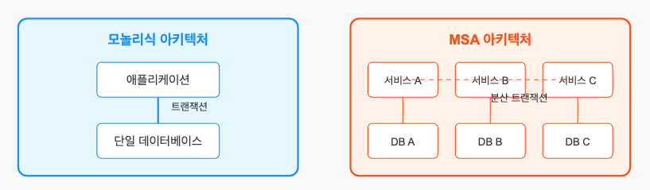
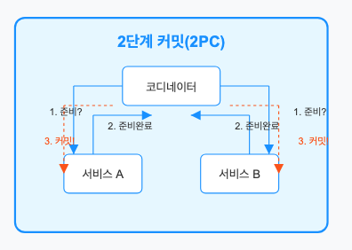
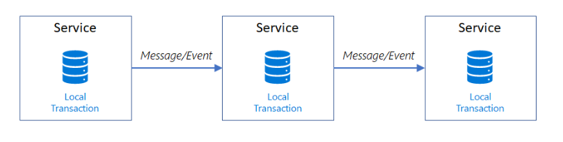
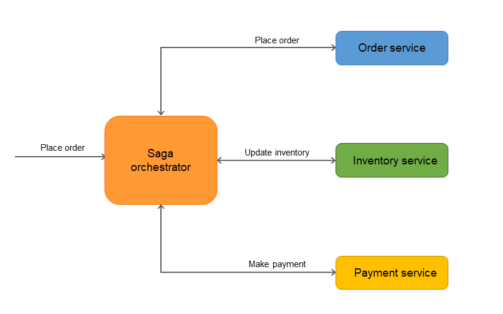
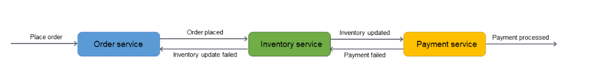

# MSA 환경에서의 트랜잭션 관리

## 기본 개념

### 트랜잭션이란?
- **정의**: DB의 상태를 변화시키는 하나의 논리적 작업 단위
- **예시**: 계좌 이체 시, 출금과 입금이 모두 성공해야 전체 작업이 완료된 것으로 간주

### ACID 속성
- **원자성(Atomicity)**: 트랜잭션의 연산들이 모두 실행되거나 모두 실행되지 않아야 함
- **일관성(Consistency)**: 트랜잭션 실행 전후에 데이터베이스는 일관된 상태여야 함
- **격리성(Isolation)**: 동시에 실행되는 트랜잭션들이 서로 영향을 주지 않아야 함
- **지속성(Durability)**: 트랜잭션이 완료되면 그 결과는 영구적으로 반영되어야 함

## MSA에서 트랜잭션 관리의 어려움

### 모놀리식 vs MSA 아키텍처

|              | 모놀리식 아키텍처 | MSA 아키텍처 |
|--------------|----------------|------------|
| **데이터베이스** | 단일 DB 사용 | 서비스별 독립 DB |
| **트랜잭션** | DBMS가 직접 관리 | 여러 서비스에 걸친 분산 트랜잭션 필요 |
| **일관성** | 쉽게 보장 가능 | 유지하기 어려움 |

### MSA 트랜잭션의 주요 문제
1. 네트워크 지연/장애 발생 가능성
2. 서비스 간 타이밍 차이
3. 서비스 중 하나 실패 시 전체 트랜잭션 영향
4. 각 서비스별 독립적인 트랜잭션 관리 필요
---
## 대표적인 분산 트랜잭션 해결 방법
1. 2pc
2. Saga
---
### 1. 2단계 커밋(2PC: Two-Phase Commit Protocol)

- 2단계: 준비, 커밋/롤백
- 코디네이터가 전체 트랜잭션을 조정합니다

#### 작동 방식
1. 트랜잭션 시작(코디네이터)
    - 트랜잭션을 시작하는 서비스가 코디네이터 역할 수행
2. 준비
    - 코디네이터는 모든 참여 서비스에 준비 메시지를 보냄
    - 참여서비스는 트랜잭션 완료가능여부 확인 후, Y/N 응답
3. 결정
    - 모든 서비스가 Y면, 코디네이터는 모든 서비스에 커밋 메시지 보냄
    - N가 있으면 모든 서비스에 중단 메시지 보냄
4. 커밋
    - 커밋 결정 되면, 모든 서비스는 실제 변경사항 적용

#### 장단점
- **장점**: 데이터 일관성 강하게 보장
- **단점**: 성능 저하, 모든 참여자가 준비될 때까지 블로킹, 코디네이터 장애 시 전체 시스템 마비

### 2. 사가(Saga) 패턴

#### 작동 방식
각 로컬 트랜잭션은 독립적으로 수행되며, 실패 시 보상 트랜잭션을 통해 롤백
1. 단일 서비스에서 원자성으로 작업 완료
2. DB 업데이트
3. 이벤트/메시지로 다음 트랜잭션 시작
4. 로컬트랜잭션 실패 시, 롤백 수행하여 이전 로컬 트랜잭션 변경 내용 취소

#### 장단점
- **장점**: 서비스 간 결합도 감소
- **단점**: 구현 복잡성, 일관성 보장이 어려움

### 유형: 코레오그래피, 오케스트레이션

### 2-1. 오케스트레이션 방식

- 중앙 조정자(오케스트레이션)가 트랜잭션 관리
- 오케스트레이터가 각 서비스에 트랜잭션 수행 요청하고, 실패 시 롤백 명령
- 트랜잭션 흐름을 중앙에서 관리하므로 간단하게 구현 가능

#### 장단점
- **장점**: 중앙 관리로 흐름 파악 용이
- **단점**: 중앙 조정자 의존성 증가

### 2-2. 코레오그래피 방식

- 각 마이크로서비스가 다른 마이크로서비스의 이벤트를 구독하여 자체적으로 트랜잭션 처리
- 중앙 조정자 없이 이벤트 기반으로 동작
- 각 서비스는 작업 완료 후 관련 이벤트를 발행하고, 다른 서비스는 해당 이벤트를 구동하여 작업 수행

#### 장단점
- **장점**: 중앙 조정자 없이 이벤트 기반으로 동작, 서비스 자율성 높음
- **단점**: 각 서비스가 자체 트랜잭션 관리로 인해 일관성 유지 어려움

### 그 외 트랜잭션 관리 방법
Event Sourcing
- 모든 트랜잭션을 이벤트 스트림으로 저장
- 이벤트 스트림을 기반으로 데이터 복구 가능
- 트랜잭션 추적 용이

CQRS
- 명령과 조회를 분리하여 명령 데이터베이스와 조회 데이터베이스를 분리
- 명령 데이터베이스는 명령 처리 로직만 저장
- 조회 데이터베이스는 조회 로직만 저장

---
[참고 자료]
- https://docs.aws.amazon.com/ko_kr/prescriptive-guidance/latest/cloud-design-patterns/saga.html
- https://tech.kakaopay.com/post/msa-transaction/
- https://ko.wikipedia.org/wiki/2%EB%8B%A8%EA%B3%84_%EC%BB%A4%EB%B0%8B_%ED%94%84%EB%A1%9C%ED%86%A0%EC%BD%9C
- https://learn.microsoft.com/ko-kr/azure/architecture/patterns/saga
https://learn.microsoft.com/ko-kr/host-integration-server/core/two-phase-commit2
- AI: gpt, clause, perplexity
