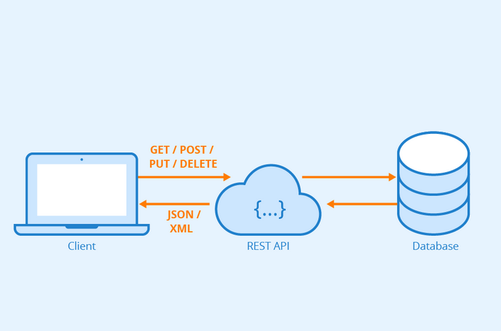

# Service Api

## 1. API 란?



**API (Application Programming Interface)** 는 어플리케이션 간 데이터를 주고받거나 특정 기능을 호출할 수 있도록 표준화된 인터페이스를 제공하는 도구입니다. API의 효과로는 **데이터 교환**, **다른 소프트웨어의 기능 실행**, **서비스 접근**이 있습니다.

ex. 구글맵 api, 소셜로그인 api, 공공데이터 api


## 2. Service API 란?

**Service API** 는 단순히 특정 기능을 실행하는 API가 아닌 특정 서비스를 실행하는 API 입니다. 내부에 비즈니스 로직이 포함되어 있으며 이 기능을 외부에 노출시켜 다른 사용자가 이용할 수 있게 합니다.

주요 특징은
- 특정 서비스(결제 서비스, 사용자 인증 서비스)에 특화됨.
- 비즈니스 로직이나 프로세스를 포함하며 단순 데이터 요성 그 이상의 역할.
- MSA에서 서비스 간의 데이터 교환을 위해 사용.

## 3. Service API vs API

| 구분   | API | Service API   |
|-------|------|--------|
| 목적 | 특정 기능을 제공 | 특정 서비스(비즈니스 로직)을 제공 |
| 추상화 수준 | 낮음   | 높음(서비스 전체를 캡슐화) |
| 복잡성 | 단순한 요청 - 응답 | 여러 API호출 또는 내부 로직을 조합하여 응답 |
| 아키텍쳐 연관성 | 독립적으로 사용 | MSA에 자주 사용 |
| 예시 | 구글 맵 API | 토스 결제 API |

API는 특정 기능이나 데이터 접근에 초첨이 맞춰져 있습니다. 반면 Service API는 비즈니스 로직, 복잡한 워크플로우를 수행합니다.


## 4. 예시 코드

- API 예시 코드 (기상청 단기예보 API)

```
public Mono<JsonResponseDto> getWeather(String x, String y) {

        TimeConfig timeConfig = new TimeConfig();
        String baseDate = timeConfig.getDate();
        String baseTime = timeConfig.getTime(); // 0200, 0500, 0800, 1100, 1400, 1700, 2000, 2300 (1일 8회)
        log.info("current date, time: {}, {}", baseDate, baseTime);
        String numOfRows = "200";
        String pageNo = "1";
        String nx = x;   // 속초 (87, 141), 상주 (81, 102), 대구(90, 91)
        String ny = y;

        String url = BASIC_URL + "?serviceKey=" + SERVICE_KEY +
                "&numOfRows=" + numOfRows + "&pageNo="+ pageNo +"&dataType=JSON" +
                "&base_date=" + baseDate + "&base_time=" + baseTime +
                "&nx=" + nx + "&ny=" + ny;

        log.info("Generated URL: {}", url); // ✅ 확인용 출력

        return webClient.get()
                .uri(URI.create(url)) // 🔹 직접 만든 URI 전달
                .retrieve()
                .bodyToMono(JsonResponseDto.class);
    }
```


- Service API(네이버 소셜 로그인 API)

```
Future<void> signInWithNaver() async {
    try {
      await NaverLoginSDK.authenticate(
        // NaverLoginSDK 를 이용해 로그인에 시도 후 토큰을 받아온다.
        callback: OAuthLoginCallback(
          onSuccess: () async {
            final accessToken = await NaverLoginSDK.getAccessToken();
            if (accessToken.isEmpty) {
              throw Exception('Naver accessToken is empty.');
            }
            print('Naver accessToken: $accessToken');
```


## 5. MSA와 연동성

결제 API 같은 경우 MSA에서 하나의 마이크로서비스로 구현되거나 외부 API를 이용하여 구현됩니다.


### 서비스 자체가 마이크로 서비스
- 서비스 자체 데이터베이스를 가지며 다른 서비스와 독립적으로 작동함.
- 다른 마이크로서비스가 Service API를 호출하여 서비스를 실행시킴.
- 다른 서비스와 로직이 분리되어 유지보수에 좋음.
- 해당 서비스의 트래픽이 몰릴 경우 독립적으로 확장이 가능함.

### 외부 Service API와 마이크로 서비스의 통합
- 직접 API를 구현하지 않고 외부 API 이용이 보편적
- 로직이 간단해지며 대부분 서비스를 API에 위임
- 개발 시간이 단축됨


[참고 문헌]

- [토스 페이먼츠] https://developers.tosspayments.com/
- [관련 블로그] https://habana4.tistory.com/entry/Service-API-vs-Software-API-%EB%B9%84%EA%B5%90
- [AWS에서 설명한 api] https://aws.amazon.com/ko/compare/the-difference-between-microservices-and-apis/