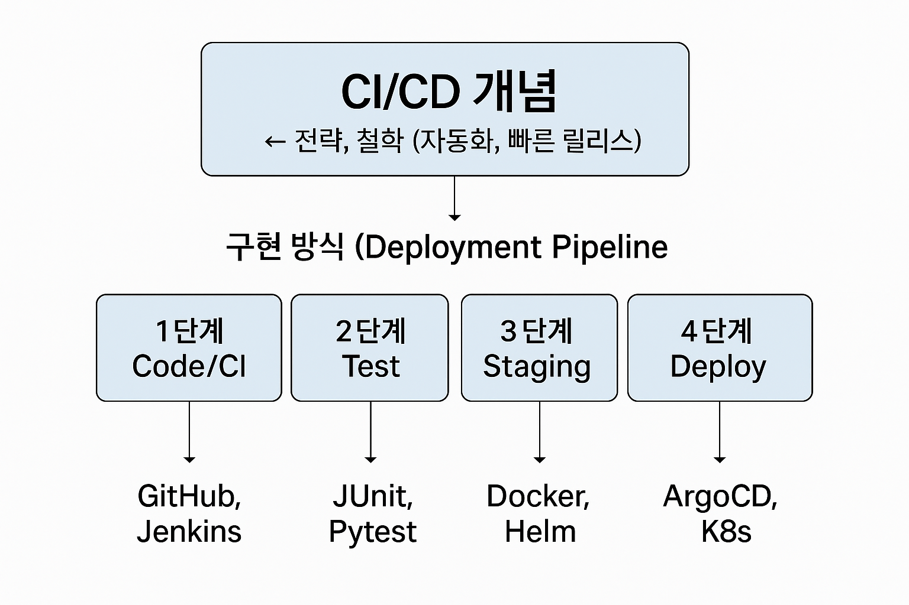
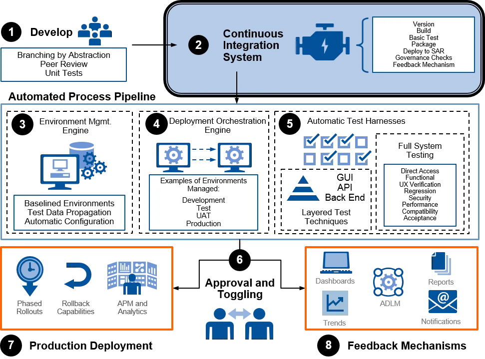
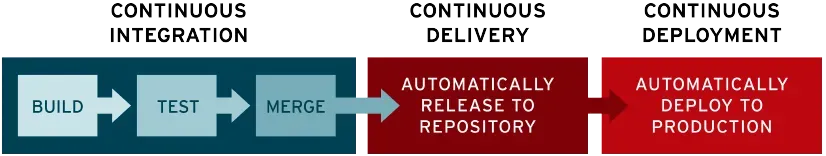
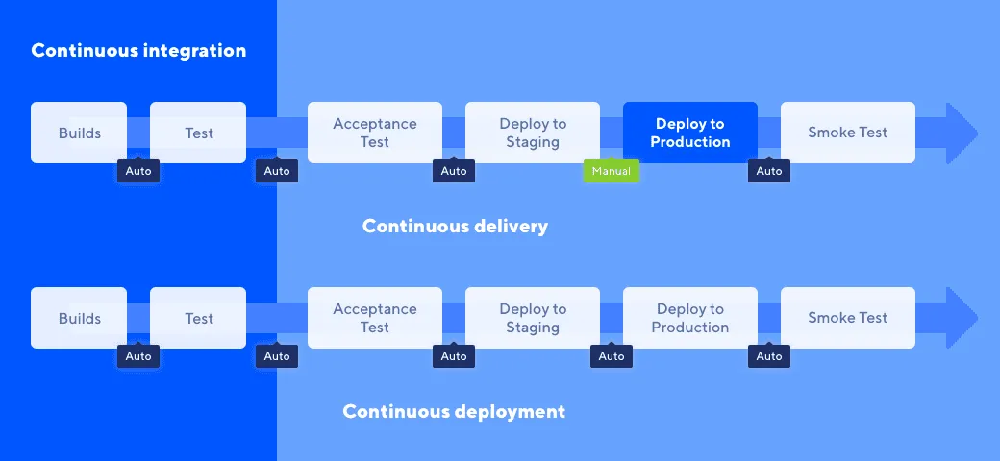
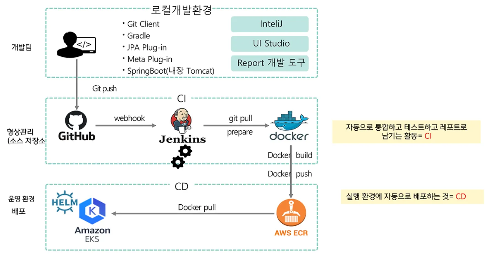
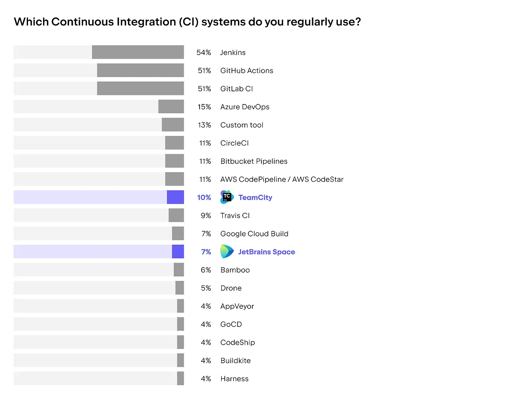

# Deployment Pipeline

## Content

- [Deployment Pipeline 개념](#deployment-pipeline-개념)
- [Deployment Pipeline 단계](#deployment-pipeline-단계)
- [MSA와 Deployment Pipeline](#msa와-deployment-pipeline)
- [CI/CD](#cicd)
- [MSA와 CI/CD](#msa와-cicd)
- [Deployment Pipeline 도구](#deployment-pipeline-도구)
- [사례](#사례)

## Deployment Pipeline 개념

- 개발 단계부터 운영 단계까지 코드 변경 사항을 처리하는 자동화된 워크플로우. 빌드, 테스트, 배포 등의 단계로 구성되어 소프트웨어가 올바르게 통합되고 검증되었으며 출시 준비가 되었는지 확인한다.
- 자동화된 빌드 및 테스트 환경을 구축할 때 흔히 겪는 어려움 중 하나는, 전체 테스트 실행에 많은 시간이 소요된다는 점이다.

  - Deployment Pipeline은 이러한 문제를 해결하기 위해 빌드 과정을 여러 단계(stage)로 나누는 방식.
  - 또한 파이프라인의 각 단계에서 코드 품질과 기능을 검사하여 문제를 조기에 파악
  - 배포 속도와 안전성 향상.

  <br>

**CI/CD vs. Deployment Pipeline**



<br><br>

## Deployment Pipeline 단계



### 1. Source: 코드 커밋 (Commit Stage)

- 개발자가 작성한 코드를 버전 관리 시스템에 반영
- Task
  - 새 기능 추가 또는 버그 수정 후 코드 커밋
  - Pull Request(PR) 생성 및 코드 리뷰 요청
  - 브랜치 전략 적용 (ex. Git Flow, trunk-based development)
- 도구
  - Git기반(GitLab, Github)
  - SVN기반 Cloud Source Repositories(GCP)
  - Code Commit(AWS)

### 2. Build

- 코드가 컴파일 및 빌드되는지 검증(소스 코드 빌드, 도커 이미지 빌드)
- Task
  - Dockerfile 해석 및 실행
  - 애플리케이션 빌드 및 설치 (예: `npm install`, `mvn install`)
  - 컴파일 및 빌드 (Java → `.jar`, Node.js → `.js` 번들링 등
  - 도커 이미지 빌드 (예:`docker build -t myapp:latest`)
- 도구
  - GitHub Actions, Jenkins, GitLab CI, Travis CI, CircleCI
  - Spinnaker, Cloud Build(GCP), Code Build(AWS)
  - Docker Hub, AWS ECR, Github Container Registry

### 3. Test

- 코드가 테스트를 통과하는지 검증
- Task
  - 정적 코드 분석 (Lint, SonarQube)
  - 단위 테스트 실행 (예: JUnit, PyTest)
  - 테스트 커버리지 측정
- 도구
  - GitHub Actions, Jenkins, GitLab CI, Travis CI, CircleCI

### 4. Artifact Storage

- 테스트 통과 후 빌드 결과물(아티팩트)을 안전하게 저장하고 버전 관리
- Task
  - JAR/WAR 파일, Docker 이미지 생성 및 저장
  - 태깅 및 버전 지정 (예: `myapp:1.0.2`)
  - 저장소에 업로드
- 도구
  - Maven, Gradle (Java)
  - Docker, DockerHub, Amazon ECR, GitHub Packages, GCP, S3

### 5. Deploy

- Staging Deployment(실제 운영 환경과 유사한 스테이징 환경에서 배포 테스트 수행) 이후 Production Deployment(운영 환경에 새로운 코드 버전 배포)를 수행함
- Task
  - 자동 스케일링, 롤링 배포, 무중단 배포
  - 카나리/블루그린 배포 방식 활용
  - 트래픽 분산 및 롤백 전략 수립
- 도구
  - Argo CD, Helm, Kubernetes
  - NGINX, Istio (서비스 메시 제어)

### 6. Monitor

- 운영 중 애플리케이션의 상태, 오류, 성능을 실시간 모니터링
- Task
  - 로그 수집 및 분석
  - 지표 기반 알림 설정 (CPU, Memory, Error rate 등)
  - 장애 발생 시 자동 롤백 트리거 가능
  - 사용자 피드백 수집 후 Backlog 등록
- 도구
  - ELK Stack (Elasticsearch, Logstash, Kibana)

<br><br>

## MSA와 Deployment Pipeline

MSA는 기능을 독립적인 마이크로 서비스로 분리하여 각 서비스가 개별적으로 빌드되고 배포될 수 있도록 설계된 아키텍처이다. 즉, MSA는 서비스 수가 많기 때문에 수동으로 배포하면 시간과 리스크가 커지기 때문에 배포 파이프라인 자동화가 필수적이다.

- 서비스 간 의존성이 낮아 병렬 배포 가능
- 기술 스택별 파이프라인 설정 용이
- 빠른 기능 추가 및 롤백 가능

<br><br>

## CI/CD

- CI/CD는 Continuous Integration 및 Continuous Delivery/Deployment를 의미하며, 소프트웨어 개발 라이프사이클을 자동화하고 간소화하여 빠르고 안정적인 배포를 가능하게 하는 개발 문화 및 기술 체계
- **CI**(Continuous Integration)는 코드 변경 사항이 공유 리포지토리에 정기적으로 빌드 및 테스트되어 통합되는 방식
- **CD**(Continuous Delivery/Deployment)는 통합된 코드를 자동으로 테스트하고 배포하는 일련의 과정
- 이 둘이 연결된 흐름을 통칭하여 **CI/CD 파이프라인**



→ 개발 주기 단축, 오류 발생 가능성 감소, 지속적인 소프트웨어 개선

<br>

### Continous Delivery vs. Continous Deployment

| 항목        | Continous Delivery    | Continous Deployment          |
| ----------- | --------------------- | ----------------------------- |
| 배포 시점   | 수동 승인 이후        | 테스트 통과 즉시 자동 배포    |
| 통제 방식   | QA 또는 운영팀이 승인 | 승인 없이 운영 환경 자동 반영 |
| 자동화 수준 | 중간                  | 최상                          |

<br>



<br>

## **MSA와 CI/CD**

- MSA 환경에서는 Agile 방법론(소규모 기능 단위로 빠르게 개발을 반복하는 방법론)이 적용 -> 기능 추가가 매우 빈번하게 발생하고 micro service의 긴밀한 동작 테스트도 중요해짐. 이런 상황에서, CI의 적용은 기능 충돌 방지 등의 이점을 제공.
- Agile 방법론이 적용될 경우, 서비스의 사용자는 최대한 빠른 시간 내에 최신 버전의 Production을 제공받을 필요가 있는데 이런 경우 소프트웨어가 언제든지 신뢰 가능한 수준의 버전을 유지할 수 있도록 하는 것이 CD의 역할.
- 이는 서비스의 **개발팀과 비즈니스팀 간의 커뮤니케이션 부족 문제를 해결해 주고, 배포에 이르기까지의 노력을 최소한으로 단축시켜 준다는 이점**을 제공.



<br>

<details>
<summary>EX) GitHub Actions 예시</summary>
<div markdown="1">

- GitHub Actions 기반 Node.js 앱의 CI/CD workflow 파이프라인 예시
  <br>
  `.github/workflows/ci-cd.yml`

```yaml
name: CI/CD Pipeline

# main 브랜치에 push나 pull request가 발생했을 때 실행
on:
	workflow_dispatch:
  push:
    branches: # 이 브랜치에 push가 되는 경우, trigger가 되어 이 깃허브 액션 파이프라인이 실행됨.
	  - develop
		paths: # develop 브랜치 안의 path를 좀 더 세밀하게 설정할 수 있음.
		  - "backend/**"
		  - ".github/workflows/backend-dev.cd.yml"
  pull_request:
    branches: [main]

jobs:
  build-test-deploy:
    runs-on: ubuntu-latest  # GitHub가 제공하는 Ubuntu VM에서 실행

    steps:
    # 1. GitHub 레포지토리에서 코드 체크아웃
    - name: Checkout source code
      uses: actions/checkout@v3

    # 2. Node.js 환경 설정
    - name: Set up Node.js
      uses: actions/setup-node@v4
      with:
        node-version: '18'

    # 3. 의존성 설치
    - name: Install dependencies
      run: npm install

    # 4. 유닛 테스트 실행
    - name: Run unit tests
      run: npm test

    # 5. Docker 이미지 빌드
    - name: Build Docker image
      run: docker build -t myapp:${{ github.sha }} .

    # 6. Docker Hub 로그인 (secrets에 등록된 자격 증명 사용)
    - name: Log in to Docker Hub
      run: echo "${{ secrets.DOCKER_PASSWORD }}" | docker login -u "${{ secrets.DOCKER_USERNAME }}" --password-stdin

    # 7. 이미지 푸시 (커밋 해시 기반 태그)
    - name: Push Docker image
      run: docker push myapp:${{ github.sha }}


deploy-on-self-hosted:
    runs-on: [self-hosted, dev]  # EC2, 온프레미스 등
    needs: build-and-push        # 위 단계가 성공해야 실행됨
    if: ${{ needs.build-and-push.result == 'success' }}

    steps:
      - name: 배포 스크립트 실행
        run: sh /home/ubuntu/deploy.sh
```

- 자체 호스팅된 서버를 이용해 Docker 이미지 pull 및 컨테이너 재시작
  <br>
  `deploy.sh`

```yaml
#!/bin/bash

APP_NAME="myapp"
IMAGE_TAG="latest"
IMAGE_NAME="mydockerhubusername/${APP_NAME}:${IMAGE_TAG}"

echo "Docker 이미지 가져오는 중: $IMAGE_NAME"
docker pull $IMAGE_NAME

echo "기존 컨테이너 중지 및 삭제"
docker stop $APP_NAME || true
docker rm $APP_NAME || true

echo "새 컨테이너 실행"
docker run -d \
  --name $APP_NAME \
  -p 80:3000 \        # 외부 포트 80 -> 컨테이너 포트 3000
  $IMAGE_NAME

echo "배포 완료"
```

```yaml
chmod +x /home/ubuntu/deploy.sh # 파일 저장 후 실행권한 부여
```

- 마지막으로 배포 서버 설정을 해주면 배포 자동화 완료.

</div>
</details>

<details>
<summary>EX) k8s를 활용한 MSA deployment 예시</summary>
<div markdown="2">
<br>
<a href="https://github.com/kenu/egovframe-msa-edu-kenu/blob/contribution/k8s/applications/backend/config/deployment.yaml">https://github.com/kenu/egovframe-msa-edu-kenu/blob/contribution/k8s/applications/backend/config/deployment.yaml</a><br>
-> deployment.yaml 파일이 여러 개 존재하는 이유는 이 Kubernetes 클러스터가 **마이크로서비스 아키텍처(MSA)**를 기반으로 구성되어 있기 때문

</div>
</details>

<br><br>

## Deployment Pipeline 도구



**Jenkins**

- 가장 많은 사람이 사용, 커뮤니티 활발
- 오픈 소스, 무료
- 서버를 직접 호스팅하고 관리해야하므로, 서버 비용은 별도
- 다양한 플러그인
- https://jenkins.io/

**GitHub Actions**

- Git을 많이 사용하기 때문에 가장 인기있는 도구
- Git과 직접 연동이 되기 때문에 workflow 작성 및 관리가 쉬움
- 다양한 플러그인을 제공
- https://docs.github.com/ko/actions

**GitLab CI**

- GitLab 플랫폼에서 자동화 빌드, 테스트 및 배포 파이프라인을 제공
- 사용이 간편하고 배포 설정이 쉬움
- 다른 플랫폼에 비해 플러그인이 적음
- https://about.gitlab.com/

<br><br>

## 사례

- LINE 엔지니어의 CI/CD 적용 사례<br>
  https://engineering.linecorp.com/ko/blog/build-a-continuous-cicd-environment-based-on-data<br>
- Jenkins 사용 기업<br>
  https://www.codenary.co.kr/techstack/detail/jenkins<br>
- Gitlab 사용 기업<br>
  https://www.codenary.co.kr/techstack/detail/jenkins<br>
- Github Action 사용 기업<br>
  https://www.codenary.co.kr/techstack/detail/githubaction

<br><br>

## References

https://www.browserstack.com/guide/deployment-pipeline
https://www.redhat.com/ko/topics/devops/what-is-ci-cd
https://katalon.com/resources-center/blog/continuous-delivery-vs-continuous-deployment
https://martinfowler.com/bliki/DeploymentPipeline.html
https://docs.github.com/en/actions/hosting-your-own-runners/managing-self-hosted-runners/about-self-hosted-runners
