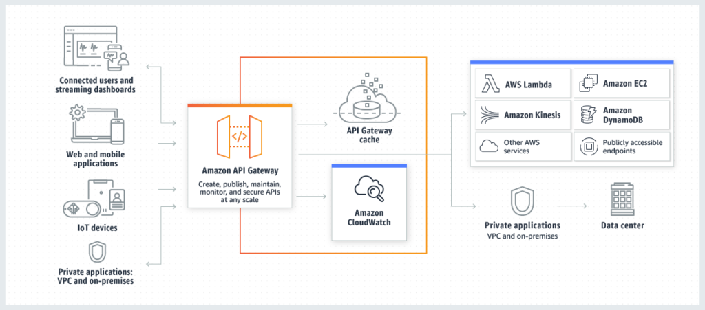
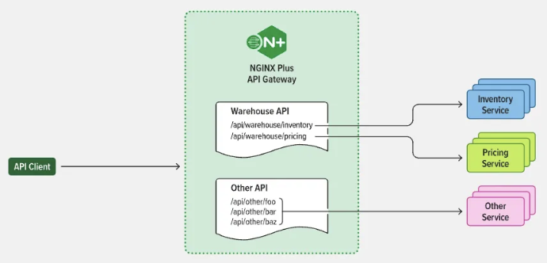

# [1] 왜 API Gateway가 필요할까?

### 🏪 현실 상황

- 배달앱에서 '주문하기' 버튼을 눌렀을 때클라이언트 앱이 처리해야 하는 일들

```
├── 🔐 사용자 인증 확인 → 인증 서비스 호출
├── 💳 결제 처리 → 결제 서비스 호출
├── 🏪 재고 확인 및 차감 → 재고 서비스 호출
├── 🚚 배송 정보 등록 → 배송 서비스 호출
├── 📱 알림 발송 → 알림 서비스 호출
└── 📊 주문 기록 저장 → 주문 서비스 호출
```

### ❌ 문제점들

- 6개의 서로 다른 서비스 주소를 알아야 함
- 각각 다른 인증 방식과 데이터 형식
- 네트워크 요청 6번 = 느린 응답
- 한 서비스가 변경되면 앱도 수정해야 함

<br/>

# [2] API Gateway란





- API Gateway는 클라이언트(사용자, 프론트엔드)의 모든 API 요청을 가장 먼저 받아들이는 "관문" 역할을 하는 서버입니다.

- 사용자는 복잡한 여러 백엔드 서비스가 숨어 있어도 하나의 주소만 알면 되고, Gateway가 알아서 적절한 서비스로 연결해줍니다.

### 예시) 호텔사례

```
손님(클라이언트) → 호텔 안내데스크(API Gateway) → 각 부서(마이크로서비스)
```

🏨 호텔 컨시어지가 하는 일:

- ✅ 손님은 컨시어지에게만 요청
- ✅ 컨시어지가 적절한 부서에 연결
- ✅ 모든 응답을 취합해서 손님에게 전달
- ✅ 손님은 복잡한 내부 구조를 몰라도 됨

- 복잡한 시스템은 안보이게 하고, 단순한 창구만 보여준다!

<br/>

# [3] API 게이트웨이의 기능

API 게이트웨이는 일반적으로 다음을 포함하는 기능을 구현함

### 1) 보안 및 인증

- 인증, 권한 부여, 엑세스 제어 및 암호화
- 클라이언트의 요청을 검증하고 인증 및 권한 부여를 수행

### 2) 라우팅 정책

- 라우팅, 속도 제한, 요청/응답 조작, 회로 차단기, 블루-그린 및 카나리아 배포, A/B 테스트, 부하 분산, 상태 검사 및 사용자 정의 오류 처리

### 3) 로깅 및 모니터링

- API 호출 및 서비스 성능을 모니터링하며 로그를 기록

추가적인 앱 및 API 수준 보안을 위해 API 게이트웨이 웹 애플리케이션 방화벽(WAF) 및 서비스 거부(DoS) 보호 기능으로 강화할 수 있음

### 4) 단일 진입점 제공

- 모든 API 요청을 **한 곳 (Endpoint)**에서 받아들임
- Ex) api.XXX.com으로 요청 <br/>-> 내부에는 N개의 마이크로서비스로 구성

```
api.쇼핑몰.com/users     → 사용자 서비스
api.쇼핑몰.com/orders    → 주문 서비스
api.쇼핑몰.com/payments  → 결제 서비스
api.쇼핑몰.com/products  → 상품 서비스

```

### 5) 복잡성 추상화

- 클라이언트는 어떤서비스가 어디에 있는지 몰라도 괜찮다
- 예를들어, 결제 서비스가 `payment-v3`에서 `payment-v4`로 바뀌어도 클라이언트에는 영향을 미치지 않는다.

### 6) 부하분산

- 여러 마이크로서비스로 요청을 전달하고 결과를 집계하여 클라이언트에게 반환

- API Gateway는 MSA에서, 복잡한 마이크로서비스 아키텍처를 효과적으로 관리하고 확장 가능한 서비스를 제공하는 역할을 합니다. 이를 통해 개발자들은 각 마이크로서비스의 핵심 비즈니스 로직에 집중할 수 있게 되며, 전체 시스템의 유지보수 및 확장이 용이해집니다.

# [4] API 게이트웨이의 이점

### ❌ API Gateway 없는 경우

```
[클라이언트]
    ├── → 인증 서비스 (auth.company.com:8001)
    ├── → 결제 서비스 (payment.company.com:8002)
    ├── → 재고 서비스 (inventory.company.com:8003)
    ├── → 배송 서비스 (delivery.company.com:8004)
    ├── → 알림 서비스 (notification.company.com:8005)
    └── → 주문 서비스 (order.company.com:8006)
```

### 문제점

```
❌ 6개 서비스 주소를 모두 알아야 함
❌ 각각 다른 인증 방식
❌ 네트워크 요청 6번 (지연시간 증가)
❌ 서비스 변경 시 클라이언트도 수정 필요
```

### ✅ API Gateway 있는 경우

```
[클라이언트] → [API Gateway] → [내부 마이크로서비스들]
                    ↓
               api.company.com
                    ↓
    ┌─────────────────────────────────────┐
    │          API Gateway                │
    └─────────────────────────────────────┘
    ├── → 인증 서비스 (내부 네트워크)
    ├── → 결제 서비스 (내부 네트워크)
    ├── → 재고 서비스 (내부 네트워크)
    ├── → 배송 서비스 (내부 네트워크)
    ├── → 알림 서비스 (내부 네트워크)
    └── → 주문 서비스 (내부 네트워크)
```

### 장점

```
✅ 하나의 주소만 기억 (api.company.com)
✅ 통일된 인터페이스
✅ 백엔드 변경이 클라이언트에 영향 없음
✅ 중앙집중식 보안 및 모니터링
```

# [5] 사용 사례

### 🎬 Netflix

- 수백 개의 마이크로서비스를 API Gateway로 통합
- 개인화 추천, 스트리밍, 결제 서비스 관리

### 🚗 Uber

- 실시간 위치, 결제, 매칭 서비스를 하나의 앱으로 통합
- 전 세계 수백만 요청을 안정적으로 처리

### 🛒 온라인 쇼핑몰

- 상품 검색, 장바구니, 결제, 배송 추적을 단일 API로 제공

<br/>

# [6] 💰 도입 효과

### 📈 개발 생산성 향상

- 백엔드 개발자: 비즈니스 로직에 집중 가능
- 프론트엔드 개발자: 단일 API 엔드포인트로 개발 단순화

### ⚡ 성능 최적화

- 응답 시간 개선 (캐싱, 로드밸런싱)
- 서버 리소스 효율적 사용

### 🔒 보안 강화

- 중앙집중식 보안 정책 관리
- 보안 사고 대응 시간 단축

<br/>

# [7] 주의사항 및 한계

### ⚠️ 고려해야 할 단점들

🔴 단일 장애점 (Single Point of Failure)

- API Gateway 다운 시 전체 시스템 영향
- 해결책: 고가용성(HA) 구성, 이중화

### ⏱️ 추가 지연시간

- 한 번의 홉(hop) 추가로 약간의 지연 발생
- 해결책: 캐싱, 최적화된 라우팅

### 🔧 설정 복잡성

- 초기 설정과 관리의 복잡성 증가
- 해결책: 단계적 도입, 자동화 도구 활용

<br/>

# API 게이트웨이 및 마이크로서비스 아키텍처

- 마이크로서비스 기반 애플리케이션의 경우 API 게이트웨이는 시스템에 대한 단일 진입점 역할을 수행함
- 마이크로서비스 앞에 위치하여 앱의 복잡성과 클라이언트를 분리함으로써 클라이언트 구현과 마이크로서비스 앱을 모두 단순화함
- 마이크로서비스 아키텍처에서 API 게이트웨이는 요청 라우팅, 구성 및 정책 시행을 담당함.
  일부 요청을 적절한 백엔드 서비스로 라우팅하여 처리하고, 다른 요청은 여러 백엔드 서비스를 호출하여 결과를 집계하여 처리함
- API 게이트웨이는 인증, 권한 부여, 모니터링, 부하 분산, 응답 처리와 같은 마이크로서비스에 대한 다른 기능을 제공하여 **비기능적 요구사항의 구현을 인프라 계층으로 오프로드하고 개발자가 핵심 비즈니스 로직에 집중할 수 있도록 돕고 앱 출시를 가속화**할 수 있다.
